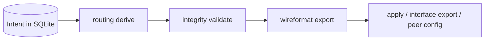
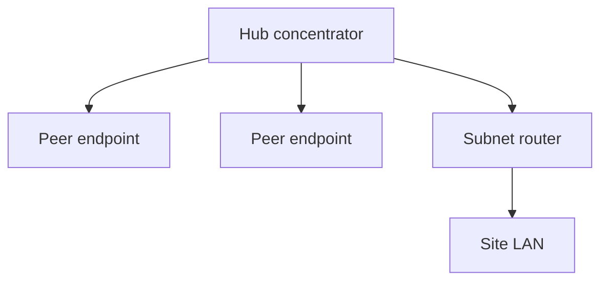
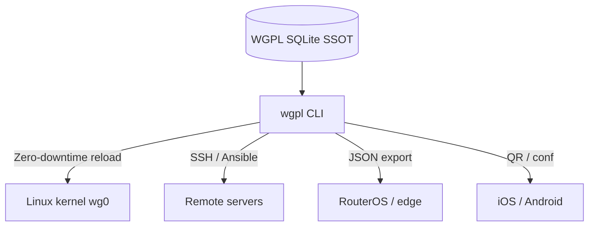

# WGPL (WireGuard Peer Lite) — Declarative Hub-and-Spoke VPN Topology CLI

[](https://github.com/aleaz/wgpl/actions/workflows/ci.yml)
[](LICENSE)
[](https://www.python.org/downloads/)


**WGPL** is a disconnected Python CLI that manages **hub-and-spoke VPN topologies** with a SQLite database as the single source of truth. You declare peers, IP pools, and routing **intent**; WGPL handles IPAM, derives WireGuard `AllowedIPs` at export time, and applies hub changes with **zero downtime** (`wg syncconf`).

**The problem:** Manual WireGuard means editing text files, hand-picking `AllowedIPs`, guessing free IPs, and restarting interfaces (dropping every session) to add one peer — with no audit trail.

**The solution:** WGPL stores **intent** (roles, routed networks, policies) in SQLite, derives hub and client `AllowedIPs` when you export or apply, allocates IPs automatically, and keeps an append-only audit log. Mutations update the database only; the kernel stays stale until you run `apply` or remote `syncconf`.

### What WGPL is / is not

| WGPL **is** | WGPL **is not** |
| --- | --- |
| Disconnected CLI; SQLite SSOT | A network daemon or control plane |
| Hub-and-spoke IPv4 topology manager | Full-mesh overlay (use Tailscale / Netmaker) |
| Intent stored; routes **derived** at export | A kernel routing or `iptables` manager |
| Peer lifecycle, IPAM, audit, config generator | IPv6 support (IPv4 pools and peers only) |
| BYOI: you create the OS `wg0` (or equivalent) | Direct site-to-site P2P without a hub |

Domain model and layers: [DESIGN.md](DESIGN.md).

## Table of Contents

- [Compared to wg-quick](#compared-to-wg-quick)
- [When to use something else](#when-to-use-something-else)
- [How it works](#how-it-works)
- [Quick start](#quick-start)
- [Routing summary](#routing-summary)
- [Features](#features)
- [Deployment patterns (BYOI)](#deployment-patterns-byoi)
- [Client provisioning](#client-provisioning)
- [Operations and audit](#operations-and-audit)
- [Integrations](#integrations)
- [Upgrading](#upgrading)
- [Configuration](#configuration)
- [Documentation map](#documentation-map)
- [Contributing](#contributing)

## Compared to wg-quick

| Feature | `wg-quick` (manual) | `wgpl` |
| --- | --- | --- |
| **Peer storage** | Text files (`.conf`) | Relational SQLite database |
| **IP allocation** | Manual (collision risk) | Automatic CIDR IPAM |
| **Routing / AllowedIPs** | Manual per peer in `.conf` | Declared intent; derived at export |
| **Applying changes** | Restarts interface (drops connections) | Zero-downtime hot-reload (`wg syncconf`) |
| **Audit & history** | None | Append-only log (SQLite triggers) |
| **Expiration** | Manual cleanup | Built-in TTL (`--expires 24h`) |

## When to use something else

- **Full-mesh or managed overlay** — Tailscale, Netmaker, or similar (WGPL targets a single hub per VPN domain, not P2P mesh).
- **Direct site-to-site without a hub** — Out of scope; configure WireGuard manually or use `peer config --allowed-ips` for one-off exports. WGPL does not model symmetric two-gateway links.
- **Site-to-site via a central hub** — **In scope.** Two subnet routers and LAN↔LAN relay through the concentrator; see [Routing summary](#routing-summary) and [docs/ROUTING.md](docs/ROUTING.md).

## How it works

WGPL persists **routing intent** in SQLite. Derived `AllowedIPs` are **never** stored. Every export path runs: validate → derive → format → output.



- **Mutations** (`peer add`, `peer update`, `interface update`, …) write the database inside transactions. They do **not** touch WireGuard.
- **Apply / export** reads intent, derives hub and client `AllowedIPs`, validates wire safety, then emits text for `wg syncconf`, client `.conf`, QR, or JSON.

See [DESIGN.md — Domain vs WireGuard](DESIGN.md#domain-model) for the full domain model.

## Quick start

### 1. Install

**Option A: Standalone binary (Linux routers)** — no runtime dependencies.

```bash
curl -sL https://github.com/aleaz/wgpl/releases/latest/download/wgpl-linux-amd64 -o /usr/local/bin/wgpl
chmod +x /usr/local/bin/wgpl
```

> Re-run the command when a new release is published to update the binary.

**Option B: Python / uv (developers and admins)** — Python 3.12+.

```bash
uv tool install wgpl
```

### 2. Register a hub and add a peer

WGPL does not create the OS WireGuard interface. A **WGPL interface** row is the hub record for one VPN domain (you may name it `wg0` to match your existing device).

```bash
# Register the hub: name, server endpoint host, hub public key, address pool
wgpl interface add wg0 vpn.example.com <WG0_PUBKEY> 10.0.0.0/24

# Add a remote-access peer (default policy: vpn_only — client reaches VPN pool only)
wgpl peer add wg0 "Alice_Laptop"

# Full Internet via hub (explicit policy):
# wgpl peer add wg0 "Road_Warrior" --allowed-ips-policy full_tunnel
```

> **Client AllowedIPs default:** `peer config` and `peer qr` derive client `AllowedIPs` from `allowed_ips_policy` (default `vpn_only`). Use `--allowed-ips-policy full_tunnel` at peer creation, or `--allowed-ips` to override a **single** export only.

### 3. Validate, apply, and distribute

```bash
wgpl validate wg0
sudo wgpl apply wg0

wgpl peer explain "Alice_Laptop"
wgpl peer qr "Alice_Laptop"
wgpl peer config "Alice_Laptop" > alice.conf
chmod 600 alice.conf
```

> If the database has **more than one** WGPL interface, pass `-i` / `--interface` to `peer config`, `peer qr`, and secret-bearing commands. See [docs/cli.md](docs/cli.md).

## Routing summary

WGPL is an **intent-based hub-and-spoke IPv4 routing generator**. You declare what each peer and the hub should reach; the tool derives WireGuard `AllowedIPs` at apply and export time.



### Terminology (quick reference)

| Term | Meaning |
| --- | --- |
| **VPN domain** | One `interfaces` row (one hub-and-spoke topology) |
| **WGPL interface** | Hub record in the DB — not necessarily the same thing as the OS netdev unless you named it that way |
| **Peer** | Remote attachment to the hub (keys, tunnel IP, routing intent) |
| **Server endpoint** | `interfaces.endpoint` host (and port) — where clients connect |
| **`peer.role = endpoint`** | End-user device (laptop, phone); no `routed_networks` |
| **`peer.role = subnet_router`** | Site gateway advertising LAN CIDRs behind the tunnel |
| **Hub AllowedIPs** | Derived server `[Peer]` block (`apply`, `interface export`, MikroTik `allowed-address`) |
| **Client AllowedIPs** | Derived in `peer config` / `peer qr` from `allowed_ips_policy` |

### `allowed_ips_policy`

| Value | Client AllowedIPs (summary) |
| --- | --- |
| `vpn_only` (default) | VPN address pool only |
| `split_tunnel` | Pool + `interface.routed_networks` |
| `all_remote_networks` | Split set + other sites' LANs (not own LANs on subnet routers) |
| `full_tunnel` | `0.0.0.0/0` |
| `custom` | `peer.custom_allowed_ips` |

Inspect derived routes with `wgpl peer explain <PEER_REF>` or `wgpl --json peer list` (`hub_allowed_ips`, `client_allowed_ips`).

### Common patterns

1. Remote access, full tunnel — `endpoint` + `full_tunnel`
2. Remote access, split tunnel — `endpoint` + `split_tunnel` (+ hub `routed_networks`)
3. VPN peers only — `endpoint` + `vpn_only`
4. VPN + all remote LANs — `endpoint` + `all_remote_networks`
5. Site subnet router — `subnet_router` + `routed_networks` + `all_remote_networks`
6. Site-to-site via hub — two `subnet_router` peers; LAN↔LAN through the concentrator

Full matrix and invalid topologies: [docs/routing_matrix.md](docs/routing_matrix.md). Specification: [docs/ROUTING.md](docs/ROUTING.md).

WGPL derives `AllowedIPs` only. **Hub packet relay** (`ip_forward`, firewall `FORWARD`, optional MASQUERADE) is operator responsibility — see [docs/runbook.md — Hub routing relay](docs/runbook.md#hub-routing-relay).

### Examples

```bash
# Remote access — route all traffic through the hub
wgpl peer add wg0 "Road_Warrior" --allowed-ips-policy full_tunnel

# Branch office gateway advertising a LAN
wgpl peer add wg0 "Branch_GW" --role subnet_router \
  --routed-networks 192.168.50.0/24 --allowed-ips-policy all_remote_networks
```

## Features

### Multi-server and IPAM

- **Composite identity:** Interface names (e.g. `wg0`) may repeat across servers; WGPL keys hubs by name + server endpoint + port.
- **Global IPAM:** Automatic free IPv4 allocation within each hub's CIDR pool.
- **Idempotent apply:** `wgpl apply` is safe to run repeatedly; only deltas reach the kernel.

### Lifecycle

- **TTL:** `--expires 48h` for contractors and temporary access (expired peers are excluded from apply/export until pruned).
- **Soft delete:** `peer remove` frees the IP while retaining audit history; `peer prune` hard-deletes inactive rows.

Details: [Operations and audit](#operations-and-audit).

### Security

- X25519 key generation in memory (`cryptography`); wire-safe validation before export.
- `chmod 600` on database and sensitive outputs; fail-closed `apply` and restore paths.
- See [SECURITY.md](SECURITY.md).

### Automation

- **`--json`** on all commands for Ansible, Terraform, and CI pipelines.
- **SQLite WAL** and exclusive transactions for safe concurrent writers.

Per-peer overrides: `MTU`, `PersistentKeepalive`, `DNS` at interface or peer level. Server endpoints validated per RFC 1123.

## Deployment patterns (BYOI)

WGPL follows **Bring Your Own Interface** (BYOI). It is not a daemon, does not create your OS WireGuard netdev, and does not configure kernel routing or `iptables`. You operate the hub; WGPL manages peers and derived config.

> **Why we don't manage `iptables`:** Tools that hijack system routing often break Docker, Kubernetes, or corporate firewalls. WGPL leaves network policy under your control.

Export paths (after derive + validate):



### Native Linux server (systemd)

Automate prune and hot-reload on the VPN gateway:

```ini
[Unit]
Description=WGPL Sync and Prune
After=wg-quick@wg0.service

[Service]
Type=oneshot
ExecStartPre=/usr/local/bin/wgpl peer prune wg0
ExecStart=/usr/bin/sudo /usr/local/bin/wgpl apply wg0
```

Trigger with a `.timer` (e.g. every 5 minutes). See [docs/runbook.md](docs/runbook.md).

### Remote Linux servers (CI/CD)

```bash
wgpl validate wg0   # optional but recommended before export
wgpl interface export wg0 > hub-peers.conf
cat hub-peers.conf | ssh root@hub-host "wg syncconf wg0 /dev/stdin"
```

### MikroTik (RouterOS v7)

```bash
wgpl --json peer list | jq -r '.[] | "/interface wireguard peers add interface=wg0 public-key=\"\(.public_key)\" allowed-address=\"\(.hub_allowed_ips | join(","))\""' > mikrotik_sync.rsc
```

Import `mikrotik_sync.rsc` on the router.

### Docker

```bash
alias wgpl='docker run --rm -it -v $(pwd)/wgpl-data:/data ghcr.io/aleaz/wgpl'
wgpl interface list
```

To apply on the **host** kernel:

```bash
docker run --rm -v $(pwd)/wgpl-data:/data \
  --cap-add NET_ADMIN --network host \
  ghcr.io/aleaz/wgpl apply wg0
```

## Client provisioning

Run these on the **management host** (where the WGPL database lives). Inspect routes before distributing configs:

```bash
wgpl peer explain "Alice_Laptop"
```

### Mobile (iOS / Android)

```bash
wgpl peer qr "Alice_Laptop"
wgpl peer qr "Alice_Laptop" -o alice-phone.png
```

### Desktop (Windows / macOS)

```bash
wgpl peer config "Alice_Laptop" > alice.conf
chmod 600 alice.conf
```

Import `alice.conf` into the official WireGuard desktop app.

### Linux (end-user machine)

On the **client laptop or workstation** (not the VPN hub), install the exported config. The interface name is a local choice (`wg-wgpl`, `wg0`, etc.):

```bash
# Run on the end-user machine after copying alice.conf
sudo cp alice.conf /etc/wireguard/wg-wgpl.conf
sudo chmod 600 /etc/wireguard/wg-wgpl.conf
sudo systemctl enable --now wg-quick@wg-wgpl
```

## Operations and audit

WGPL is built for teams that need traceability and controlled lifecycles.

### Post-mutation workflow

Mutations update SQLite only. To reach WireGuard:

1. `wgpl validate [INTERFACE]` — routing topology, pool fit, wire-format checks (errors exit 1).
2. `sudo wgpl apply INTERFACE` — or `interface export | ssh … wg syncconf` on a remote hub.

See [docs/runbook.md — Post-mutation checklist](docs/runbook.md#post-mutation-checklist).

### Temporary access (TTL)

```bash
wgpl peer add wg0 "Contractor_Audit" --expires 48h
```

Expired peers are ignored by `apply` and `interface export` until pruned.

### Deletion and garbage collection

```bash
wgpl peer remove wg0 <PEER_REF>          # soft delete — IP freed, audit retained
wgpl peer prune wg0                      # hard-delete inactive rows
wgpl peer remove wg0 <PEER_REF> --hard   # immediate physical delete + audit event
```

### Audit trail

```bash
wgpl interface history wg0
wgpl peer history wg0 <PEER_REF>
```

The `audit_events` table is append-only (SQLite triggers block UPDATE/DELETE).

### Backups and disaster recovery

```bash
wgpl db dump -o backup.db
chmod 600 backup.db
wgpl db restore --yes backup.db   # destructive; validates schema and wire fields
```

After restore: `wgpl validate`, then `apply` on each managed interface.

> **Multi-server note:** Two interfaces may share the same name (e.g. `wg0`) if server endpoint/port differ. Use the numeric **interface ID** from `wgpl interface list` when names are ambiguous.

### Audit retention

| Goal | Tool |
| --- | --- |
| Archive history for compliance | `wgpl db dump -o archive-YYYY-MM.db`; store off-host with `chmod 600` |
| Remove inactive peer rows (not audit) | `wgpl peer prune <interface>` |
| Query past events | `wgpl peer history` / `wgpl interface history` |

There is no `audit prune` — audit rows are never deleted in-place by design.

When combined with proper OS access controls, centralized audit and IP lifecycle records can simplify access reviews (e.g. SOC2 / ISO27001 workflows).

## Integrations

Working examples in `examples/`:

- **[Ansible Playbook](examples/ansible-deployment.yml):** Multi-server zero-downtime updates from a control node.
- **[Terraform & Cloud Firewalls](examples/terraform-external-data.tf):** Whitelist peer IPs in AWS Security Groups via Terraform `external` data.
- **[GitHub Actions (GitOps)](examples/github-actions-gitops.yml):** Deploy VPN state from CI/CD.
- **[FastAPI Self-Service Portal](examples/fastapi-self-service.py):** API wrapper for QR-based onboarding.

## Upgrading

Recent releases enforce **minimum MTU 1280** on export, apply, and mutations (was 576). `wgpl validate` also reports routing topology issues.

```bash
wgpl validate
wgpl interface list --json | jq '.[] | select(.mtu != null and .mtu < 1280)'
wgpl peer list --json | jq '.[] | select(.mtu != null and .mtu < 1280)'
```

Fix low MTU values (`interface update --mtu 1280`, `peer update --mtu 1280`, or `--clear-mtu`), then upgrade the tool. Full checklist: [docs/runbook.md — Upgrading WGPL](docs/runbook.md#upgrading-wgpl).

## Configuration

| Variable | Description | Default |
| --- | --- | --- |
| `WGPL_DB_PATH` | Path to the SQLite database | `~/.wgpl.db` |
| `WGPL_WG_BIN` | Path to `wg` for `apply` / `syncconf` (**ignored when UID 0**; defaults to `/usr/bin/wg`) | `wg` (PATH) |

`wireguard-tools` (`wg`) is required only for `wgpl apply` on the same machine.

Run `wgpl --help` or see [docs/cli.md](docs/cli.md) for the full command reference.

## Documentation map

| Document | Contents |
| --- | --- |
| [DESIGN.md](DESIGN.md) | Domain model, layered architecture, security boundaries |
| [docs/ROUTING.md](docs/ROUTING.md) | Routing model, patterns, scope, invariants |
| [docs/routing_matrix.md](docs/routing_matrix.md) | Executable topology spec (valid / invalid) |
| [docs/runbook.md](docs/runbook.md) | Production procedures (validate, apply, hub relay, backup) |
| [docs/cli.md](docs/cli.md) | Full CLI reference |
| [SECURITY.md](SECURITY.md) | Threat model and security policies |
| [CONTRIBUTING.md](CONTRIBUTING.md) | Development workflow and commit conventions |

## Contributing

```bash
git clone https://github.com/aleaz/wgpl.git
cd wgpl
uv sync
uv run pytest
```

Please read [CONTRIBUTING.md](CONTRIBUTING.md) before opening a pull request.

## Author

- **Alejandro Azario** — [GitHub](https://github.com/aleaz)

## License

MIT
