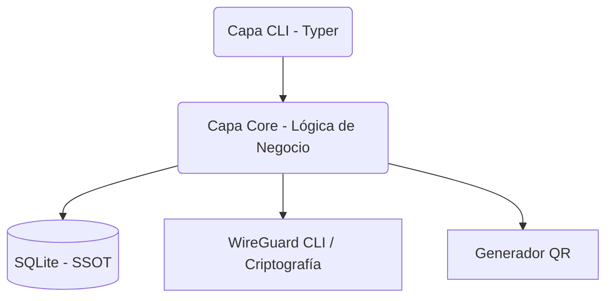

# WireGuard Peer Lite (WGPL)

[](https://github.com/aleaz/wgpl/actions/workflows/ci.yml)
[](LICENSE)
[](https://www.python.org/downloads/)

**WGPL** es una herramienta de línea de comandos minimalista y segura, diseñada exclusivamente para gestionar el ciclo de vida de *peers* (clientes) de WireGuard.

---

## Resumen General

**WGPL** existe para resolver el problema de la gestión de configuraciones de WireGuard a escala, sin la complejidad de sistemas pesados o interfaces web vulnerables. 

**Propósito:** Proveer un compilador de configuración desconectado y un Gestor de Estado para WireGuard.
**Filosofía:** Mantener la seguridad, la automatización y la simplicidad como prioridades. WGPL no toca tu red, tu firewall ni tus contenedores Docker. Hace una sola cosa excepcionalmente bien: gestionar de manera declarativa el estado criptográfico y las IPs de tus clientes VPN.
**Audiencia:** Administradores de sistemas, ingenieros DevOps y entusiastas de la seguridad que buscan automatizar su infraestructura VPN sin sacrificar el control o la seguridad.
**Madurez actual:** El proyecto está listo para su lanzamiento 1.0, ofreciendo estabilidad y protección transaccional.

---

## Características Principales

**Gestión de Peers e Interfaces**
- Creación, actualización y eliminación de peers e interfaces.
- Asignación automática de direcciones IP libres dentro de un bloque CIDR.
- Configuración de DNS a nivel de interfaz (por defecto) o por peer (override).

**Automatización y Estado**
- Salida estricta en JSON (`--json`) para integración M2M (Ansible, Terraform, Bash).
- Única Fuente de Verdad (SSOT) usando una base de datos SQLite segura local.
- Sincronización declarativa con el kernel mediante `wg syncconf` (sin interrupciones).

**Seguridad y Criptografía**
- Generación de llaves públicas/privadas (X25519) y Preshared Keys en memoria nativa sin depender de la CLI de `wg`.
- Permisos estrictos automáticos (`chmod 600`) en bases de datos y códigos QR exportados.
- Validación proactiva del estado de las redes e IPs antes de modificar la base de datos.

**Gestión de Base de Datos**
- Exportación (`dump`) lógica de la base de datos completa.
- Restauración (`restore`) segura e inmutable con recuperación atómica y prevención de corrupción.

**Exportación de Clientes**
- Archivos `.conf` completos listos para ser consumidos.
- Códigos QR nativos en la terminal (ASCII) o exportables como imágenes PNG.

---

## Arquitectura

WGPL implementa una **Arquitectura Hexagonal (Puertos y Adaptadores)**.

- **Capa de Dominio (`core.py`)**: Contiene toda la lógica de negocio (validación de IPs, generación de configuraciones, coordinación de transacciones).
- **Adaptador de Base de Datos (`db.py`)**: Interfaz con SQLite. Utiliza parámetros preparados (prevenir inyección SQL) y modo WAL para operaciones concurrentes seguras.
- **Adaptador de WireGuard (`wireguard.py`)**: Generación criptográfica en Python puro (`cryptography`) e integración segura con el comando `wg` mediante `subprocess` (sin shells).
- **Capa de Presentación (`cli.py`)**: Usa Typer para exponer los comandos al usuario y formatear salidas (Tablas Rich o JSON puro).

**Flujo de Ejecución:**
El usuario invoca la CLI $\rightarrow$ `core.py` valida la lógica de negocio $\rightarrow$ `db.py` persiste en SQLite (ACID) $\rightarrow$ Si se solicita, `core.py` usa `wireguard.py` para sincronizar (`wg syncconf`) o generar exportables (QR/.conf).



---

## Instalación

WGPL requiere **Python 3.12+**. 

### Instalación Recomendada (vía `uv`)

Si deseas instalar la herramienta a nivel de sistema de forma aislada:

```bash
uv tool install wgpl
wgpl --help
```

### Ejecución Local de Desarrollo

Si prefieres ejecutarlo sin instalación global, clonando el repositorio:

```bash
git clone https://github.com/aleaz/wgpl.git
cd wgpl
uv sync
uv run wgpl --help
```

### Instalación vía pip (Entorno Virtual)

```bash
python3 -m venv .venv
source .venv/bin/activate
pip install .
wgpl --help
```

**Requisitos Previos (Opcional):**
El binario del sistema `wg` (`wireguard-tools`) **solo** es necesario si deseas ejecutar `wgpl apply` en la misma máquina para sincronizar configuraciones locales.

---

## Configuración

WGPL está diseñado para requerir configuración cero, pero provee mecanismos robustos para ajustar su comportamiento.

**1. Ubicación de la Base de Datos**
WGPL guarda todo su estado criptográfico en una base de datos local SQLite. Por defecto, esta se ubica en `~/.wgpl.db`.
Puedes sobrescribir este valor de dos formas:

- **Variables de Entorno:**
  ```bash
  export WGPL_DB_PATH="/etc/wireguard/wgpl.sqlite3"
  wgpl interface list
  ```
- **Argumento de la CLI:**
  ```bash
  wgpl --db /tmp/test_db.sqlite3 peer list
  ```

*WGPL siempre forzará permisos 0600 en este archivo para proteger tus claves privadas.*

---

## Quick Start

Un ejemplo mínimo funcional en menos de un minuto:

```bash
# 1. Registra tu interfaz VPN en la base de datos local
wgpl interface add wg0 vpn.example.com <TU_LLAVE_PUBLICA_SERVIDOR> 10.0.0.0/24 --port 51820

# 2. Crea un nuevo peer (Generará claves e IPs automáticamente)
wgpl peer add wg0 "Mi_Celular"

# 3. Exporta la configuración del peer a un archivo .conf
wgpl peer config <ID_DEL_PEER> > celular.conf

# 4. O genera un código QR para escanear en la app móvil
wgpl peer qr <ID_DEL_PEER>

# 5. Finalmente, aplica los cambios al servidor WireGuard (si estás ejecutando WGPL en el servidor)
wgpl apply wg0
```

---

## Referencia de la CLI

Todos los comandos soportan el parámetro global `--json` o `-j` **antes** del subcomando (ej. `wgpl -j peer list`) para producir salidas parseables por máquinas.

### Comandos Generales

- **`wgpl apply <INTERFAZ>`**: Sincroniza atómicamente el estado declarativo de la base de datos hacia el kernel de WireGuard usando `wg syncconf`.
- **`wgpl validate [INTERFAZ]`**: Verifica la integridad de la base de datos (por ejemplo, asegurando que todos los clientes tienen IPs que aún pertenecen al bloque de la interfaz).

### Gestión de Interfaces (`wgpl interface`)

- **`add <NOMBRE> <ENDPOINT> <PUBKEY> <POOL_IP> [--port] [--dns]`**: Registra una nueva red WireGuard.
- **`list`**: Muestra las interfaces actuales.
- **`update <NOMBRE> [opciones]`**: Modifica el endpoint, pool, DNS o puerto.
- **`export <NOMBRE>`**: Imprime la configuración de bloques `[Peer]` compatible con el servidor WireGuard para sincronización remota.
- **`remove <NOMBRE>`**: Elimina la interfaz y **todos** sus peers en cascada.

### Gestión de Peers (`wgpl peer`)

- **`add <INTERFAZ> <NOMBRE> [--ip] [--dns]`**: Crea un nuevo cliente. La llave pública y privada se generan automáticamente.
- **`list`**: Muestra todos los clientes registrados. Retorna prefijos cortos amigables a la vista humana.
- **`config <ID>`**: Muestra la configuración cliente `[Interface]` y `[Peer]` incluyendo sus claves secretas, lista para ser usada por el usuario.
- **`qr <ID> [-o <RUTA_PNG>]`**: Genera el QR del cliente. Puede ser en ASCII (terminal) o guardarse en un PNG cifrado.
- **`update <INTERFAZ> <ID> [opciones]`**: Permite cambiar el nombre, forzar una IP específica o cambiar el override de DNS.
- **`remove <INTERFAZ> <ID>`**: Borra permanentemente a un peer.

### Gestión de Base de Datos (`wgpl db`)

- **`dump`**: Extrae la base de datos completa como script SQL (salida a `stdout`). Ideal para backups de cron.
- **`restore <ARCHIVO>`**: Sobrescribe la base de datos viva restaurando el script SQL pasado por argumento o stdin (`-`).

---

## Flujos de Trabajo Típicos

### A. Inicialización y Gestión de un Peer
1. Configuras el entorno: `export WGPL_DB_PATH=/sec/wgpl.db`
2. Creas el servicio: `wgpl interface add wg0 mi-empresa.com pubkey 192.168.10.0/24`
3. Agregas un empleado: `wgpl peer add wg0 "Laptop_Ana"`
4. Compartes acceso: `wgpl peer qr "Laptop_Ana" -o /tmp/ana_qr.png` y se lo envías por un canal seguro.

### B. Flujo "Desconectado" (GitOps / Terraform / Ansible)
Puedes instalar WGPL en tu máquina de CI/CD. Todo el estado reside en tu repositorio (quizás guardando los dumps).
Para aplicar el estado remoto sin instalar `wgpl` en tu servidor de producción:

```bash
# Se exporta la configuración del estado "Deseado" de la BD, y se le envía al servidor.
wgpl interface export wg0 | ssh root@mi-servidor-vpn "wg syncconf wg0 /dev/stdin"
```

### C. Backup y Restauración Segura
**Hacer Backup:**
```bash
wgpl db dump > backup_2026.sql
chmod 600 backup_2026.sql
```
**Restaurar ante desastres:**
```bash
wgpl db restore backup_2026.sql
```
*La restauración usa archivos temporales y es transaccional, evitando corrupción en caso de que el script falle a la mitad.*

---

## Flujo de Trabajo de Peers

El ciclo de vida de un peer sigue un camino declarativo estricto:

1. **Borrador (Draft) / Creación:** El usuario invoca `peer add`. WGPL toma bloqueos SQLite exclusivos (WAL), busca la próxima IP libre, genera material criptográfico nativo en RAM y lo guarda. El kernel de WireGuard aún no sabe que el peer existe.
2. **Distribución:** El usuario extrae el material secreto usando `peer config` o `peer qr`.
3. **Refinamiento (Opcional):** El usuario ajusta los overrides de DNS (`peer update ... --dns 8.8.8.8`) o cambia el nombre del peer.
4. **Sincronización de Estado (Apply):** El administrador o script ejecuta `wgpl apply wg0`. WGPL construye un archivo temporal en memoria y usa la directiva atómica `wg syncconf` para hacer que el estado real del kernel coincida 100% con la base de datos sin interrumpir el tráfico existente.

---

## Estructura del Proyecto

El código está estructurado bajo `src/wgpl/`:

- `core.py`: Orquestador principal, lógica de validación de dominios e IPs. Expone métodos transaccionales para la CLI.
- `db.py`: Adaptador de persistencia. Define esquemas y maneja cursores SQLite.
- `cli.py`: Interfaz de terminal construida sobre *Typer* y *Rich*. Encargada del manejo de errores visuales o JSON.
- `wireguard.py`: Adaptador de criptografía y wrappers para los subprocesos del binario `wg` del sistema.
- `exceptions.py`: Errores de dominio tipados y personalizados (`PeerAlreadyExistsError`, `InvalidPeerIpError`, etc).

---

## Desarrollo

Para contribuir al desarrollo del proyecto, necesitarás `uv`.

1. **Clonar e instalar dependencias de desarrollo:**
   ```bash
   git clone https://github.com/aleaz/wgpl.git
   cd wgpl
   uv sync
   ```
2. **Ejecutar Pruebas:**
   ```bash
   uv run pytest
   ```
3. **Comprobación de Calidad Estática (Linting & Tipado):**
   ```bash
   uv run ruff check tests/ src/
   uv run mypy tests/ src/
   ```
4. **Formateo de Código:**
   ```bash
   uv run ruff format
   ```

---

## Pruebas

El proyecto cuenta con un 100% de cobertura teórica en pruebas críticas, divididas en:

- **Pruebas Unitarias:** Para funciones de validación de dominio (cálculo de subredes, generación criptográfica independiente).
- **Pruebas de Integración (Base de Datos):** Empleando *fixtures* de Pytest que montan bases de datos SQLite temporales y verifican que las transacciones `COMMIT`/`ROLLBACK` operan correctamente en operaciones CRUD.
- **Pruebas End-to-End (CLI):** Se emplea `typer.testing.CliRunner` para interactuar con la consola simulando entradas del usuario, especialmente probando los parseos y respuestas del output `--json`.

Las pruebas se ejecutan utilizando el comando `uv run pytest`.

---

## Solución de Problemas (Troubleshooting)

**Error: "wg executable not found in PATH"**
*Causa:* Estás intentando usar `wgpl apply`, el cual depende obligatoriamente del kernel de WireGuard.
*Solución:* Instala `wireguard-tools` (ej. `apt install wireguard-tools`) en tu sistema operativo, o usa la exportación desconectada (`interface export`).

**Error: "WGPL_DB_PATH no tiene permisos"**
*Causa:* Si ejecutas la aplicación como usuario `root` y se creó el archivo `.wgpl.db`, y posteriormente lo usas sin privilegios (`sudo`), fallará al leer.
*Solución:* Asegura que el usuario que ejecuta `wgpl` es propietario del archivo de la BD o cuenta con los permisos necesarios, recordando que WGPL siempre asegura que la base de datos tenga `chmod 600`.

**Error de "IP Outside Pool" en `validate`**
*Causa:* Has encogido la subred de la interfaz (`interface update --address-pool`), pero aún existen clientes antiguos cuyas IPs recaen fuera del nuevo rango especificado.
*Solución:* Elimina dichos peers viejos o modifícales su IP explícitamente usando `peer update ... --ip <NUEVA_IP>`.

---

## Consideraciones de Rendimiento

- **Velocidad SQLite (WAL):** El proyecto usa `PRAGMA journal_mode=WAL` por defecto en su conexión, haciendo que las lecturas y escrituras simultáneas por múltiples procesos de CI no generen bloqueos perjudiciales.
- **Criptografía Aislada:** WGPL usa `cryptography` nativo de Python para generar pares de llaves y códigos QR, por lo que nunca invoca costosos comandos `wg genkey` paralelos en la terminal, ahorrando tiempo significativo de fork/exec de binarios al crear cientos de peers.
- **Límites de Almacenamiento:** Debido a su naturaleza ligera, WGPL escala sin problemas hasta manejar decenas de miles de peers. El tamaño de la base de datos se mantiene típicamente muy por debajo de los 10MB incluso en escenarios densos.

---

## Mapa de Documentación

Para sumergirse en detalles más técnicos sobre las decisiones del proyecto, consulta los siguientes artefactos internos:

- [Arquitectura y Principios (`wgpm-decisions.md`)](.agents/memory/wgpm-decisions.md): Decisiones arquitectónicas, justificación del uso de SQLite sobre archivos planos y el flujo atómico del proyecto.
- [Reglas de Contribución (`CONTRIBUTING.md`)](CONTRIBUTING.md): Estándares de estilo de programación y uso estricto del linter en nuevos PRs.

---

## Contribuciones

Las contribuciones siempre son bienvenidas. 
Cualquier persona que busque hacer una contribución primero debe leer [CONTRIBUTING.md](CONTRIBUTING.md) para comprender la estructura de dependencias de los módulos (ej. no mezclar Typer en `core.py`), la estrategia de control de versiones y convenciones de *commits*. En resumen: crea tu rama, desarrolla usando `uv`, pasa los tests locales, formatea el código y abre un Pull Request contra la rama `main`.

---

## Licencia

Este proyecto está bajo la [Licencia MIT](LICENSE). Puedes usarlo libremente en entornos personales, de código abierto o comerciales.
