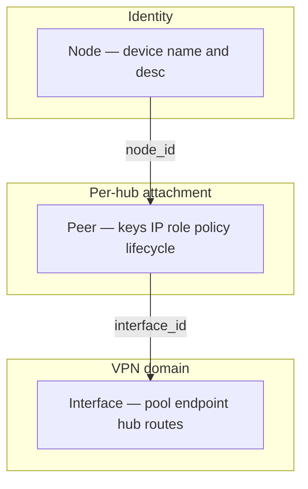
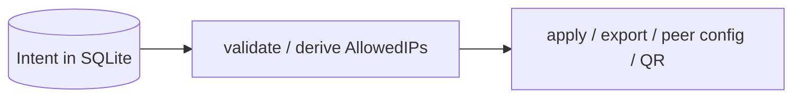

# WGPL (WireGuard Peer Lite) — Declarative Hub-and-Spoke VPN Topology CLI

[](https://github.com/aleaz/wgpl/actions/workflows/ci.yml)
[](LICENSE)
[](https://www.python.org/downloads/)


**WGPL (WireGuard Peer Lite)** is a disconnected Python CLI for **hub-and-spoke VPN topologies**. You declare routing **intent** in SQLite (the single source of truth); WGPL derives WireGuard `AllowedIPs`, allocates IPv4 addresses, tracks peer lifecycle and audit, and applies hub changes with **zero downtime** (`wg syncconf`). You bring your own OS interface (BYOI).

Hand-editing `wg0.conf` means picking `AllowedIPs` and free IPs by hand, restarting the interface to add a peer, and keeping no durable access history. WGPL stores topology intent in the database, derives hub and client `AllowedIPs` on validate/apply/export (never stored), and leaves the kernel unchanged until you run `apply` or remote `syncconf`.

**Compatibility (1.0.x):** The `1.0.x` line follows [Semantic Versioning](https://semver.org/). Patch and minor releases in `1.0.x` will not break existing CLI commands, flags, or public `--json` field names. Breaking CLI or JSON changes require a new major version (`2.0.0`).

**Start here:** [Quick Start](#quick-start) · [docs/routing.md](docs/routing.md) · [Documentation map](#documentation-map)

## What WGPL is / is not

| WGPL **is** | WGPL **is not** |
| --- | --- |
| Declarative hub-and-spoke IPv4 topology manager | A network daemon or control plane |
| Routing intent engine + WireGuard config generator | Full-mesh overlay (use Tailscale / Netmaker) |
| Disconnected CLI; SQLite SSOT | A kernel routing or `iptables` manager |
| Peer lifecycle, IPAM, append-only audit | IPv6 support (IPv4 pools and peers only) |
| BYOI: you create the OS `wg0` (or equivalent) | Direct site-to-site P2P **without** a hub |

Architecture and module layers: [DESIGN.md](DESIGN.md).

## Table of Contents

- [What WGPL is / is not](#what-wgpl-is--is-not)
- [Quick Start](#quick-start)
- [Why WGPL](#why-wgpl)
- [Concepts](#concepts)
- [Routing](#routing)
- [Highlights](#highlights)
- [Integrations](#integrations)
- [Configuration](#configuration)
- [Documentation map](#documentation-map)
- [Contributing](#contributing)

## Quick Start

### 1. Install

**Recommended: Python / uv** (Python 3.12+)

```bash
uv tool install wgpl
# or: pip install wgpl
```

**Experimental: standalone Linux binary**

Unsigned release artifact for air-gapped routers. Prefer `uv`/`pip` when possible.
Verify the checksum from the GitHub Release (`SHA256SUMS`) before running.

```bash
curl -sL https://github.com/aleaz/wgpl/releases/latest/download/wgpl-linux-amd64 \
  -o /usr/local/bin/wgpl
# Verify SHA-256 against SHA256SUMS from the same release, then:
chmod +x /usr/local/bin/wgpl
```

### 2. Bring your own hub interface (BYOI)

WGPL does **not** create the OS WireGuard netdev. Create `wg0` (or equivalent) first,
then copy its **public key** for `interface add`.

```bash
# Example: minimal hub with wg-quick (adjust Address/ListenPort to your site)
sudo install -m 600 /dev/null /etc/wireguard/wg0.conf
# Put a [Interface] block with PrivateKey, Address (e.g. 10.0.0.1/24), ListenPort
sudo systemctl enable --now wg-quick@wg0
# Public key for WGPL (this is <WG0_PUBKEY> below):
sudo wg show wg0 public-key
```

If `wgpl apply` later fails because the interface does not exist, finish this step
first — see [docs/runbook.md — Troubleshooting](docs/runbook.md#troubleshooting).

### 3. Pin the database and register a hub

Pin a database path so `sudo apply` and non-root mutations share the same SSOT:

```bash
export WGPL_DB_PATH="$HOME/.wgpl.db"
# or pass --db "$HOME/.wgpl.db" on every command
```

| Term | Meaning |
| --- | --- |
| **Server endpoint** | Host (and port) where **clients** connect — e.g. `vpn.example.com` in `interface add` |
| **`peer.role = endpoint`** | An **end-user device** (laptop/phone), not the hub hostname |

A **WGPL interface** row is the hub record for one VPN domain (you may name it `wg0` to match your OS device).

```bash
# Register the hub: name, server endpoint host, hub public key, address pool
# Add --port N if the hub does not listen on the default 51820
wgpl interface add wg0 vpn.example.com <WG0_PUBKEY> 10.0.0.0/24

# Attach a remote-access device (default policy: vpn_only — client reaches VPN pool only)
# The positional <NAME> find-or-creates the Node; the Peer is the attachment on wg0
wgpl peer add wg0 "Alice_Laptop"

# Optional explicit identity (same result as find-or-create above):
# wgpl node add "Alice_Laptop" --desc "Alice laptop"
# wgpl peer add wg0 --node "Alice_Laptop"

wgpl peer list
```

> **Client AllowedIPs:** `peer config` / `peer qr` derive from `allowed_ips_policy` (default `vpn_only`). `--allowed-ips` overrides a single export only; for a persistent policy, set `--allowed-ips-policy` on `peer add` or `peer update`.

### 4. Validate, apply, inspect, and distribute

Canonical flow: **validate → apply → explain → distribute**.

```bash
wgpl validate wg0
sudo --preserve-env=WGPL_DB_PATH wgpl apply wg0
# equivalent: sudo wgpl --db "$HOME/.wgpl.db" apply wg0

# Use a peer ID / prefix / node name from `peer list` as <PEER_REF>
wgpl peer explain <PEER_REF>
wgpl peer qr <PEER_REF>
wgpl peer config <PEER_REF> > alice.conf
chmod 600 alice.conf
```

`<PEER_REF>` is a peer UUID, a unique UUID prefix, or (when unambiguous) the node name shown in `peer list`. If the database has **more than one** WGPL interface, pass `-i` / `--interface` to `peer explain`, `peer config`, `peer qr`, and other secret-bearing commands. See [docs/cli.md](docs/cli.md).

Install the exported config or QR on the end-user device — OS steps:
[docs/runbook.md — Client provisioning](docs/runbook.md#client-provisioning).

## Why WGPL

### vs `wg-quick` (manual config files)

| Feature | `wg-quick` (manual) | `wgpl` |
| --- | --- | --- |
| **Peer storage / IPAM** | Text files; manual IPs | SQLite + automatic CIDR IPAM |
| **Routing / AllowedIPs** | Manual per peer in `.conf` | Declared intent; **derived** at export |
| **Applying changes** | Restarts interface (drops connections) | Zero-downtime hot-reload (`wg syncconf`) |
| **Audit / TTL / verify** | None / manual | Append-only audit, `--expires`, `validate` + [routing matrix](docs/routing_matrix.md) |

### Fit / not a fit

WGPL is a **local, auditable intent store** with deterministic derivation — not a coordinated mesh control plane. You keep full control of keys, backups, and hub relay; you operate `apply` and OS forwarding yourself.

- **Full-mesh or managed overlay** — Tailscale, Netmaker, or similar (WGPL targets one hub per VPN domain, not P2P mesh).
- **Direct site-to-site without a hub** — **Out of scope.** Configure WireGuard manually, or use `peer config --allowed-ips` for a one-off export override.
- **Site-to-site via a central hub** — **In scope.** Two `subnet_router` peers; LAN↔LAN through the concentrator. See [docs/routing.md — Site-to-site](docs/routing.md#site-to-site-via-hub-vs-direct).

## Concepts

WGPL models a **declarative hub-and-spoke VPN topology**, not WireGuard text files. WireGuard (`[Interface]`, `[Peer]`, `AllowedIPs`) is an **export format** produced at apply/export time.



- **Node** — global device identity (`wgpl node`); rename with `node update` (`peer update` has no `--name`).
- **Peer** — attachment of a node to one hub (keys, IP, routing intent, lifecycle).
- **Interface** — hub record for one VPN domain (pool, endpoint, optional hub routes).

Full domain table and identity rules: [DESIGN.md — Domain model](DESIGN.md#domain-model).

Operator view (mutations never touch the kernel until you apply or export):



- **Mutations** write the database only; they do **not** touch WireGuard.
- **Apply / export** derives routes, validates, then emits text for `wg syncconf`, client `.conf`, QR, or JSON.
- **`wgpl apply`** fails closed if the database fails consistency checks.

Module-level emit gate and layering: [DESIGN.md](DESIGN.md).

## Routing

Declare `role`, `routed_networks`, and `allowed_ips_policy` on interfaces and peers.
WGPL derives `AllowedIPs` at export; hub packet relay (`ip_forward`, firewall) stays
with the operator — [docs/runbook.md — Hub routing relay](docs/runbook.md#hub-routing-relay).

| Policy | Client AllowedIPs (summary) |
| --- | --- |
| `vpn_only` (default) | VPN address pool only |
| `split_tunnel` | Pool + `interface.routed_networks` |
| `all_remote_networks` | Split set + other sites' LANs |
| `full_tunnel` | `0.0.0.0/0` |
| `custom` | `peer.custom_allowed_ips` |

Eight hub-and-spoke patterns, glossary, LAN↔LAN, and invariants:
[docs/routing.md](docs/routing.md). Executable topology spec:
[docs/routing_matrix.md](docs/routing_matrix.md). Inspect with
`wgpl peer explain <PEER_REF>`.

Day-2 ops (validate/apply, TTL, prune, backup, deploy, client OS):
[docs/runbook.md](docs/runbook.md).

## Highlights

- **Composite identity:** Interface names may repeat across servers; hubs are keyed by name + server endpoint + port. Use the numeric **interface ID** from `wgpl interface list` when names collide.
- **Global IPAM** within each hub CIDR; **idempotent** `wgpl apply` (deltas only).
- **Device identity** via `wgpl node`; same device can attach to several hubs. **TTL** (`--expires`), soft delete, and prune — see [runbook](docs/runbook.md#temporary-access-ttl).
- **Fail-closed** emit/apply/restore; `chmod 600` on DB and sensitive outputs; append-only audit (no secrets in metadata) — [SECURITY.md](SECURITY.md).
- **Strict `--json`** for automation (including derived `hub_allowed_ips` / `client_allowed_ips`).
- **Wire-safe MTU** (minimum **1280** or unset); server endpoints RFC 1123 (IPv4/hostname; IPv6 endpoints rejected).
- **BYOI deploy:** systemd, remote `syncconf`, Docker, MikroTik — [runbook — Deployment](docs/runbook.md#deployment-patterns-byoi).

## Integrations

Copy-paste starting points in `examples/`:

- **[Ansible Playbook](examples/ansible-deployment.yml):** Multi-server zero-downtime updates from a control node.
- **[Terraform & Cloud Firewalls](examples/terraform-external-data.tf):** Whitelist peer IPs in AWS Security Groups via Terraform `external` data.
- **[GitHub Actions (GitOps)](examples/github-actions-gitops.yml):** Deploy VPN state from CI/CD.
- **[FastAPI Self-Service Portal](examples/fastapi-self-service.py):** Illustrative API wrapper for QR-based onboarding (requires `WGPL_PORTAL_API_KEY`).

## Configuration

| Variable | Description | Default |
| --- | --- | --- |
| `WGPL_DB_PATH` | Path to the SQLite database | `~/.wgpl.db` |
| `WGPL_WG_BIN` | Path to `wg` for `apply` / `syncconf` (**ignored when UID 0**; defaults to `/usr/bin/wg`) | `wg` (PATH) |

`wireguard-tools` (`wg`) is required only for `wgpl apply` on the same machine.

Docker image: `ghcr.io/aleaz/wgpl` — see [docs/runbook.md — Docker](docs/runbook.md#deployment-patterns-docker).

Run `wgpl --help` or see [docs/cli.md](docs/cli.md) for the full command reference.
Permissions and WAL sidecars: [docs/runbook.md — Environment and permissions](docs/runbook.md#environment-and-permissions).

## Documentation map

| Document | Contents |
| --- | --- |
| [DESIGN.md](DESIGN.md) | Domain model, layered architecture, security boundaries |
| [docs/routing.md](docs/routing.md) | Routing model, patterns, scope, invariants |
| [docs/routing_matrix.md](docs/routing_matrix.md) | Executable topology spec (valid / invalid) |
| [docs/runbook.md](docs/runbook.md) | Production procedures (validate, apply, hub relay, deploy, client OS, backup, compliance) |
| [docs/cli.md](docs/cli.md) | Full CLI reference |
| [SECURITY.md](SECURITY.md) | Threat model and security policies |
| [CONTRIBUTING.md](CONTRIBUTING.md) | Development workflow and commit conventions |
| [MAINTAINERS.md](MAINTAINERS.md) | Maintainer ownership |
| [CHANGELOG.md](CHANGELOG.md) | Release history |
| [CODE_OF_CONDUCT.md](CODE_OF_CONDUCT.md) | Community conduct |

## Contributing

```bash
git clone https://github.com/aleaz/wgpl.git
cd wgpl
uv sync --dev
uv tool run pre-commit install
uv run ruff check src/ tests/
uv run mypy src/ tests/
uv run pytest
```

Please read [CONTRIBUTING.md](CONTRIBUTING.md) before opening a pull request.

## Author

- **Alejandro Azario** — [GitHub](https://github.com/aleaz)

## License

MIT
