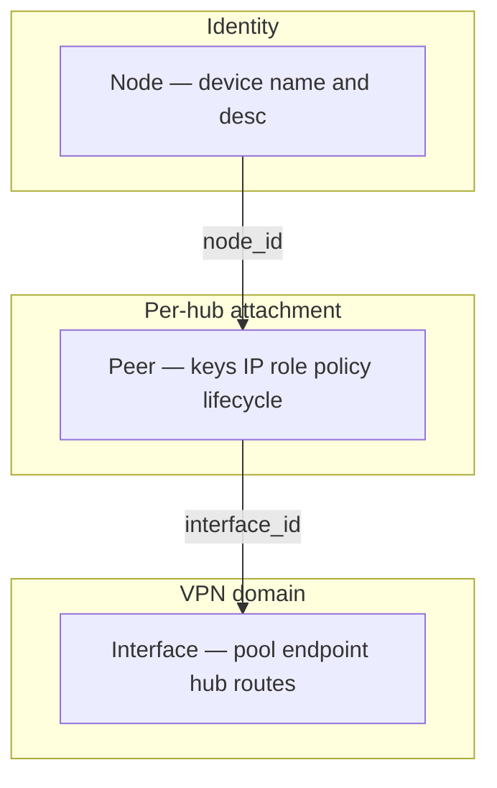
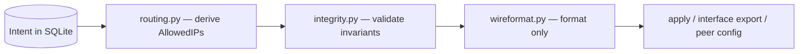
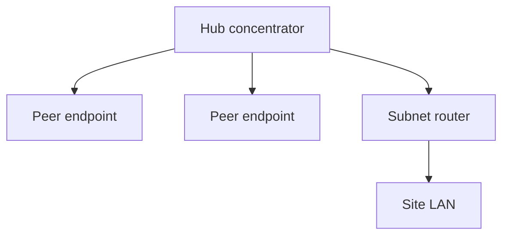
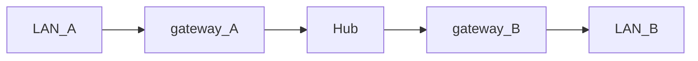
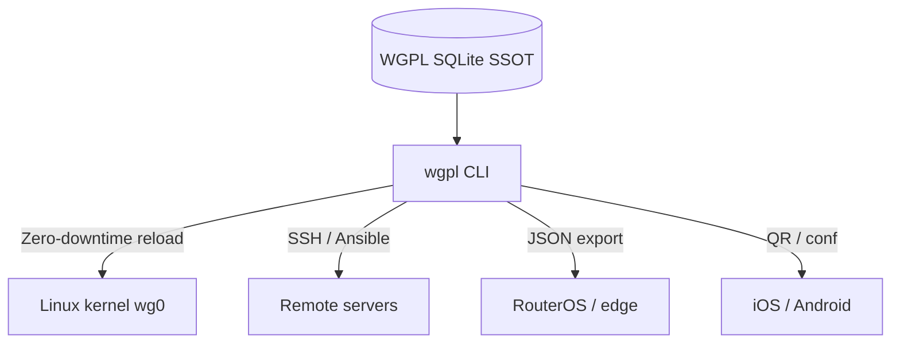

# WGPL (WireGuard Peer Lite) — Declarative Hub-and-Spoke VPN Topology CLI

[](https://github.com/aleaz/wgpl/actions/workflows/ci.yml)
[](LICENSE)
[](https://www.python.org/downloads/)


**WGPL (WireGuard Peer Lite)** is a lightweight, disconnected Python CLI that manages **hub-and-spoke VPN topologies** with a SQLite database as the single source of truth. You declare routing **intent** (roles, routed networks, policies); WGPL derives WireGuard `AllowedIPs` at export time, handles IPv4 IPAM, manages peer lifecycle and audit, and applies hub changes with **zero downtime** (`wg syncconf`).

**Start here:** [Quick Start](#quick-start) · [Domain model](#domain-model) · [Routing intent](#routing-intent) · [Documentation map](#documentation-map)

**The Problem:** Managing WireGuard manually means editing text files (`wg0.conf`), hand-picking `AllowedIPs`, guessing which IPs are free, and restarting interfaces (dropping active connections) to add one peer. Topology changes are error-prone, hard to review, and leave no durable history of who was granted access.

**The Solution:** WGPL decouples VPN **topology intent** from your OS. Intent lives in SQLite; hub and client `AllowedIPs` are **derived** when you validate, apply, or export — never stored. Mutations update the database only; the kernel stays stale until you run `apply` or remote `syncconf`. With proper OS-level access controls, centralized lifecycle records can simplify SOC2 and ISO27001 access reviews.

## What WGPL is / is not

| WGPL **is** | WGPL **is not** |
| --- | --- |
| Declarative hub-and-spoke IPv4 topology manager | A network daemon or control plane |
| Routing intent engine + WireGuard config generator | Full-mesh overlay (use Tailscale / Netmaker) |
| Disconnected CLI; SQLite SSOT | A kernel routing or `iptables` manager |
| Peer lifecycle, IPAM, append-only audit | IPv6 support (IPv4 pools and peers only) |
| BYOI: you create the OS `wg0` (or equivalent) | Direct site-to-site P2P **without** a hub |

Full domain model and module layers: [DESIGN.md](DESIGN.md).

## Table of Contents

- [What WGPL is / is not](#what-wgpl-is--is-not)
- [Domain model](#domain-model)
- [How it works](#how-it-works)
- [Compared to wg-quick and overlays](#compared-to-wg-quick-and-overlays)
- [When to use something else](#when-to-use-something-else)
- [Quick Start](#quick-start)
- [Routing intent](#routing-intent)
- [Features](#features)
- [Operations and audit](#operations-and-audit)
- [Deployment patterns (BYOI)](#deployment-patterns-byoi)
- [Client provisioning](#client-provisioning)
- [Integrations](#integrations)
- [Configuration](#configuration)
- [Documentation map](#documentation-map)
- [Contributing](#contributing)

## Domain model

WGPL models a **declarative hub-and-spoke VPN topology**, not WireGuard text files. WireGuard (`[Interface]`, `[Peer]`, `AllowedIPs`) is an **export format** produced at apply/export time.



| Concept | Meaning |
| --- | --- |
| **VPN domain** | One `interfaces` row — a hub-and-spoke topology (pool, hub endpoint, optional hub-local routes, all remote attachments) |
| **WGPL interface** | Hub record in the DB — not necessarily the same as the OS netdev unless you named it that way (BYOI) |
| **Node** | Global **device identity** (unique `name`, optional `desc`); managed with `wgpl node` |
| **Peer** | A node's **attachment** to one interface: keys, tunnel IP, routing intent, lifecycle. Display name comes from the node |
| **Routing intent** | `role`, `routed_networks`, `allowed_ips_policy`, `custom_allowed_ips`, `interface.routed_networks` — **persisted** |
| **Hub / Client AllowedIPs** | **Derived** at export by `routing.py` — **never** stored |

**Identity vs attachment.** The node is *who* the device is. The peer is *how* that device participates on a given hub. One node may attach to several interfaces (one peer row each). A node may attach to a given interface **at most once** while active.

Rename a device with `wgpl node update` — `peer update` has no `--name`.

See [DESIGN.md — Domain model](DESIGN.md#domain-model) and [docs/routing.md — Glossary](docs/routing.md#glossary).

## How it works

WGPL persists **routing intent** in SQLite. Every export path runs an **emit gate** before output:



| Stage | Module | Responsibility |
| --- | --- | --- |
| Derive | `routing.py` | Single source of hub/client `AllowedIPs` (pure functions, no I/O) |
| Validate | `integrity.py` + `consistency.py` | Wire-safe fields, activation gates, topology checks (`wgpl validate`) |
| Format | `wireformat.py` | Serialize precomputed CIDRs to `.conf` text — **must not** compute routes |
| Orchestrate | `core.py` | Mutations, emit gates, IPAM, audit |

- **Mutations** (`peer add`, `peer update`, `interface update`, `node update`, …) write the database inside transactions. They do **not** touch WireGuard.
- **Apply / export** reads intent, derives routes, validates, then emits text for `wg syncconf`, client `.conf`, QR, or JSON.
- **`wgpl apply`** fails closed if the database fails consistency checks (before `wg syncconf`).

Topology validation: errors exit **1**; warnings exit **0** (review before production either way).

## Compared to wg-quick and overlays

### vs `wg-quick` (manual config files)

| Feature | `wg-quick` (manual) | `wgpl` |
| --- | --- | --- |
| **Peer storage** | Text files (`.conf`) | Relational SQLite database |
| **IP allocation** | Manual (collision risk) | Automatic CIDR IPAM |
| **Routing / AllowedIPs** | Manual per peer in `.conf` | Declared intent; **derived** at export |
| **Applying changes** | Restarts interface (drops connections) | Zero-downtime hot-reload (`wg syncconf`) |
| **Audit & history** | None | Append-only log (SQLite triggers) |
| **Expiration** | Manual cleanup | Built-in TTL (`--expires 24h`) |
| **Topology verification** | Manual | `wgpl validate` + `peer explain` + [routing matrix](docs/routing_matrix.md) |

### vs managed overlays (Tailscale, Netmaker, …)

WGPL is a **local, auditable intent store** with deterministic derivation — not a coordinated mesh control plane. You keep full control of keys, backups, and hub relay; you operate `apply` and OS forwarding yourself. See [When to use something else](#when-to-use-something-else).

## When to use something else

Scope boundaries before you invest.

- **Full-mesh or managed overlay** — Tailscale, Netmaker, or similar (WGPL targets one hub per VPN domain, not P2P mesh).
- **Direct site-to-site without a hub** — **Out of scope.** A symmetric tunnel between two site gateways with no concentrator is not modeled. Configure WireGuard manually, or use `peer config --allowed-ips` for a one-off export override.
- **Site-to-site via a central hub** — **In scope.** Two `subnet_router` peers; LAN↔LAN traffic relays through the concentrator. WGPL derives all WireGuard `AllowedIPs`; you enable `ip_forward` and firewall rules on the hub. See [Routing intent](#routing-intent) and [docs/routing.md — Site-to-site](docs/routing.md#site-to-site-via-hub-vs-direct).

## Quick Start

### 1. Install

**Option A: Standalone Binary (Recommended for Linux Routers)**

No dependencies required.

```bash
curl -sL https://github.com/aleaz/wgpl/releases/latest/download/wgpl-linux-amd64 -o /usr/local/bin/wgpl
chmod +x /usr/local/bin/wgpl
```

> **Update Note:** The standalone binary must be updated manually by re-running this command when a new release is published.

**Option B: Python / uv (Recommended for Developers & Admins)**

Requires Python 3.12+.

```bash
uv tool install wgpl
```

**Prerequisite (BYOI):** Create the hub WireGuard interface with `wg-quick` (e.g. `wg0`) before `wgpl apply` can sync peers to the kernel.

### 2. Register a hub and attach a device

A **WGPL interface** row is the hub record for one VPN domain (you may name it `wg0` to match your OS device). The **server endpoint** is where clients connect (`vpn.example.com` below) — not the same as `peer.role = endpoint` (an end-user device).

```bash
# Register the hub: name, server endpoint host, hub public key, address pool
# Add --port N if the hub does not listen on the default 51820
wgpl interface add wg0 vpn.example.com <WG0_PUBKEY> 10.0.0.0/24

# Attach a remote-access device (default policy: vpn_only — client reaches VPN pool only)
# The positional <NAME> find-or-creates the Node; the Peer is the attachment on wg0
wgpl peer add wg0 "Alice_Laptop"

# Explicit device identity first (optional — same result as find-or-create above):
# wgpl node add "Alice_Laptop" --desc "Alice laptop"
# wgpl peer add wg0 --node "Alice_Laptop"
```

> **Default client routes:** `peer config` and `peer qr` derive client `AllowedIPs` from `allowed_ips_policy` (default `vpn_only`).

> **Override one export:** `--allowed-ips` changes a single `peer config` / `peer qr` output only. For a persistent policy, set `--allowed-ips-policy` on `peer add` or `peer update`.

### 3. Validate, apply, inspect, and distribute

```bash
wgpl validate wg0
sudo wgpl apply wg0

# Inspect derived routes (hub/client AllowedIPs; LAN↔LAN checklist for subnet routers)
wgpl peer explain <PEER_REF>

wgpl peer qr <PEER_REF>
wgpl peer config <PEER_REF> > alice.conf
chmod 600 alice.conf
```

`<PEER_REF>` is a peer UUID, a unique UUID prefix, or (when unambiguous) the node name shown in `peer list`. If the database has **more than one** WGPL interface, pass `-i` / `--interface` to `peer explain`, `peer config`, `peer qr`, and other secret-bearing commands. See [docs/cli.md](docs/cli.md).

## Routing intent

For hub-and-spoke reachability beyond simple peer lists, declare routing intent on interfaces and peers. WGPL derives `AllowedIPs`; it does **not** configure `ip_forward`, `iptables`, or physical LAN routing.



### Terminology (quick reference)

| Term | Meaning |
| --- | --- |
| **Server endpoint** | `interfaces.endpoint` host (and port) — where clients connect |
| **`peer.role = endpoint`** | End-user device (laptop, phone); no `routed_networks` |
| **`peer.role = subnet_router`** | Site gateway advertising LAN CIDRs behind the tunnel |
| **`interface.routed_networks`** | CIDRs behind the hub (split-tunnel internal routes) |
| **`peer.routed_networks`** | CIDRs behind a subnet router |
| **Hub AllowedIPs** | Derived server `[Peer]` block (`apply`, `interface export`, MikroTik `allowed-address`) |
| **Client AllowedIPs** | Derived in `peer config` / `peer qr` from `allowed_ips_policy` |

Industry mapping (Tailscale / Netmaker / WireGuard): [docs/routing.md — Glossary](docs/routing.md#glossary).

### `allowed_ips_policy`

| Value | Client AllowedIPs (summary) |
| --- | --- |
| `vpn_only` (default) | VPN address pool only |
| `split_tunnel` | Pool + `interface.routed_networks` |
| `all_remote_networks` | Split set + other sites' LANs (own LANs excluded on subnet routers) |
| `full_tunnel` | `0.0.0.0/0` |
| `custom` | `peer.custom_allowed_ips` |

Inspect derived routes with `wgpl peer explain <PEER_REF>` or `wgpl --json peer list --interface wg0` (`hub_allowed_ips`, `client_allowed_ips`).

### Operational patterns

Eight hub-and-spoke patterns (detail in [docs/routing.md](docs/routing.md)):

| # | Pattern | role | allowed_ips_policy |
| --- | --- | --- | --- |
| 1 | Remote access, full tunnel | `endpoint` | `full_tunnel` |
| 2 | Remote access, split tunnel | `endpoint` | `split_tunnel` (+ hub `routed_networks`) |
| 3 | VPN peers only | `endpoint` | `vpn_only` |
| 4 | VPN + all remote LANs | `endpoint` | `all_remote_networks` |
| 5 | Site subnet router | `subnet_router` | `all_remote_networks` |
| 6 | Site-to-site via hub | 2× `subnet_router` | `all_remote_networks` |
| 7 | Endpoint ↔ endpoint via hub | `endpoint` | `vpn_only` |
| 8 | Manual exception | any | `custom` |

Executable valid/invalid topology spec: [docs/routing_matrix.md](docs/routing_matrix.md).

### LAN↔LAN via hub (four legs)

For site-to-site through a concentrator, four routing legs must be complete (hub config + both client exports). `wgpl peer explain` on a subnet router shows a **LAN↔LAN checklist** with a `complete` flag per remote site.



**Operator responsibility:** WGPL derives `AllowedIPs` only. Hub packet relay (`ip_forward`, firewall `FORWARD`, optional MASQUERADE) remains your responsibility. See [docs/runbook.md — Hub routing relay](docs/runbook.md#hub-routing-relay).

### Examples

```bash
# Split tunnel — hub advertises internal nets; clients pull them via policy
wgpl interface add wg0 vpn.example.com <WG0_PUBKEY> 10.0.0.0/24 \
  --routed-networks 10.10.0.0/16,10.20.0.0/16
wgpl peer add wg0 "Office_User" --allowed-ips-policy split_tunnel

# Remote access — route all traffic through the hub
wgpl peer add wg0 "Road_Warrior" --allowed-ips-policy full_tunnel

# Branch office gateway advertising a LAN (add --keepalive on NAT'd gateways)
wgpl peer add wg0 "Branch_GW" --role subnet_router \
  --routed-networks 192.168.50.0/24 --allowed-ips-policy all_remote_networks \
  --keepalive 25
```

## Features

### Multi-server and IPAM

- **Composite identity:** Interface names (e.g. `wg0`) may repeat across servers; WGPL keys hubs by name + server endpoint + port.
- **Global IPAM:** Automatic free IPv4 allocation within each hub's CIDR pool.
- **Idempotent apply:** `wgpl apply` is safe to run repeatedly; only deltas reach the kernel.

### Lifecycle and nodes

- **Device identity:** `wgpl node` manages global records (unique name + description). `peer add <iface> <name>` find-or-creates the node; `--node <ref>` attaches an existing one. The same device can attach to several hubs.
- **TTL:** `--expires 48h` for contractors and temporary access (expired peers are excluded from apply/export until pruned).
- **Soft delete:** `peer remove` frees the IP while retaining audit history; `peer prune` hard-deletes inactive peer rows. Node identities persist; `wgpl node prune` removes orphan devices (zero attachments).

### Security

- X25519 key generation in memory (`cryptography`); wire-safe validation in emit gates before export.
- `chmod 600` on database and sensitive outputs; fail-closed `apply` and restore paths.
- Append-only audit (`audit_events`); secrets never stored in audit metadata.
- See [SECURITY.md](SECURITY.md).

### Automation

- **Strict JSON output (`--json`)** for M2M integration (Ansible, Terraform, Bash), including derived `hub_allowed_ips` / `client_allowed_ips` on peer list/show.
- **Hot-reloads:** Declarative synchronization with the Linux kernel using `wg syncconf` (without dropping TCP connections).

### Safe concurrency

- **CI/CD ready:** SQLite WAL mode and exclusive locks help multiple pipelines avoid corrupting state when coordinating writes.

### WireGuard fields

- **Per-peer overrides:** `MTU`, `PersistentKeepalive`, and `DNS` at the WGPL interface (default) or per peer.
- **Wire-safe MTU:** minimum **1280** on mutations and export (or unset).
- **Server endpoints** validated per RFC 1123.

## Operations and audit

Day-2 workflows for teams running WGPL in production.

### Post-mutation workflow

1. `wgpl validate [INTERFACE]` — pool fit, wire-format checks, routing topology (errors exit 1; warnings exit 0).
2. `sudo wgpl apply INTERFACE` — or `interface export | ssh … wg syncconf` on a remote hub.

Details: [docs/runbook.md — Post-mutation checklist](docs/runbook.md#post-mutation-checklist).

### Temporary access (TTL)

```bash
wgpl peer add wg0 "Contractor_Audit" --expires 48h
```

Expired peers are ignored by `apply` and `interface export` until pruned.

### Deletion and garbage collection

```bash
wgpl peer remove wg0 <PEER_REF>          # soft delete — IP freed, audit retained
wgpl peer prune wg0                      # hard-delete inactive peer rows
wgpl peer remove wg0 <PEER_REF> --hard   # immediate physical delete + audit event
wgpl node prune                          # remove orphan device identities
```

### Audit trail

```bash
wgpl interface history wg0
wgpl peer history wg0 <PEER_REF>
wgpl node history <NODE_REF>
```

The `audit_events` table is append-only (SQLite triggers block UPDATE/DELETE). There is no `audit prune` — audit rows are never deleted in-place by design.

### Backups and disaster recovery

```bash
wgpl db dump -o backup.db    # creates a new file; refuses to overwrite an existing path
chmod 600 backup.db
wgpl db restore --yes backup.db   # destructive; validates schema and wire fields
```

Restore fails closed on **error**-severity validation issues; **warnings** do not block restore (a state the CLI can create must be restorable from its own backup). After restore: `wgpl validate`, then `apply` on each managed interface.

### Database diagnostics

```bash
wgpl db doctor          # diagnose schema and audit trigger issues
wgpl db doctor --repair # reinstall triggers and normalize deleted_at
```

### Wire-safe MTU

```bash
wgpl validate
wgpl interface list --json | jq '.[] | select(.mtu != null and .mtu < 1280)'
wgpl peer list --json | jq '.[] | select(.mtu != null and .mtu < 1280)'
```

Fix low MTU values with `interface update --mtu 1280`, `peer update --mtu 1280`, or `--clear-mtu`. Full checklist: [docs/runbook.md — Wire-safe MTU](docs/runbook.md#wire-safe-mtu).

### Compliance notes

| Goal | Tool |
| --- | --- |
| Archive history for compliance | `wgpl db dump -o archive-YYYY-MM.db`; store off-host with `chmod 600` |
| Remove inactive peer rows (not audit) | `wgpl peer prune <interface>` |
| Query past events | `peer history` / `interface history` / `node history` |

With proper OS access controls, these records support periodic access reviews.

> **Multi-server note:** Two interfaces may share the same name (e.g. `wg0`) if server endpoint/port differ. Use the numeric **interface ID** from `wgpl interface list` when names are ambiguous.

## Deployment patterns (BYOI)

Where and how to run WGPL against your existing WireGuard hubs (BYOI — see [What WGPL is / is not](#what-wgpl-is--is-not)).

> **Why we don't manage `iptables`:** Tools that hijack system routing often break Docker, Kubernetes, or corporate firewalls. WGPL leaves network policy under your control.



### Native Linux server (systemd)

Automate prune and hot-reload on the VPN gateway:

```ini
[Unit]
Description=WGPL Sync and Prune
After=wg-quick@wg0.service

[Service]
Type=oneshot
ExecStartPre=/usr/local/bin/wgpl peer prune wg0
ExecStart=/usr/bin/sudo /usr/local/bin/wgpl apply wg0
```

Trigger with a `.timer` (e.g. every 5 minutes). See [docs/runbook.md](docs/runbook.md).

### Remote Linux servers (CI/CD)

```bash
wgpl validate wg0
wgpl interface export wg0 > hub-peers.conf
cat hub-peers.conf | ssh root@hub-host "wg syncconf wg0 /dev/stdin"
```

### MikroTik (RouterOS v7)

```bash
wgpl --json peer list --interface wg0 | jq -r '.[] | "/interface wireguard peers add interface=wg0 public-key=\"\(.public_key)\" allowed-address=\"\(.hub_allowed_ips | join(","))\""' > mikrotik_sync.rsc
```

Import `mikrotik_sync.rsc` on the router.

<a id="deployment-patterns-docker"></a>

### Docker

```bash
alias wgpl='docker run --rm -it -v $(pwd)/wgpl-data:/data ghcr.io/aleaz/wgpl'
wgpl interface list
```

To apply on the **host** kernel:

```bash
docker run --rm -v $(pwd)/wgpl-data:/data \
  --cap-add NET_ADMIN --network host \
  ghcr.io/aleaz/wgpl apply wg0
```

## Client provisioning

Export formats for end-user devices — run on the **management host** unless noted. Run `wgpl peer explain` before distributing configs when routing intent is non-trivial.

### Mobile (iOS / Android)

```bash
wgpl peer qr <PEER_REF>
wgpl peer qr <PEER_REF> -o alice-phone.png
```

### Desktop (Windows / macOS)

```bash
wgpl peer config <PEER_REF> > alice.conf
chmod 600 alice.conf
```

Import `alice.conf` into the official WireGuard desktop app.

### Linux (end-user machine)

On the **client laptop or workstation** (not the VPN hub), install the exported config. The interface name is a local choice (`wg-wgpl`, `wg0`, etc.):

```bash
# Run on the end-user machine after copying alice.conf
sudo cp alice.conf /etc/wireguard/wg-wgpl.conf
sudo chmod 600 /etc/wireguard/wg-wgpl.conf
sudo systemctl enable --now wg-quick@wg-wgpl
```

## Integrations

Copy-paste starting points in `examples/`:

- **[Ansible Playbook](examples/ansible-deployment.yml):** Multi-server zero-downtime updates from a control node.
- **[Terraform & Cloud Firewalls](examples/terraform-external-data.tf):** Whitelist peer IPs in AWS Security Groups via Terraform `external` data.
- **[GitHub Actions (GitOps)](examples/github-actions-gitops.yml):** Deploy VPN state from CI/CD.
- **[FastAPI Self-Service Portal](examples/fastapi-self-service.py):** Illustrative API wrapper for QR-based onboarding (requires `WGPL_PORTAL_API_KEY`).

## Configuration

| Variable | Description | Default |
| --- | --- | --- |
| `WGPL_DB_PATH` | Path to the SQLite database | `~/.wgpl.db` |
| `WGPL_WG_BIN` | Path to `wg` for `apply` / `syncconf` (**ignored when UID 0**; defaults to `/usr/bin/wg`) | `wg` (PATH) |

`wireguard-tools` (`wg`) is required only for `wgpl apply` on the same machine.

Docker image: `ghcr.io/aleaz/wgpl` — see [Deployment patterns — Docker](#deployment-patterns-docker).

Run `wgpl --help` or see [docs/cli.md](docs/cli.md) for the full command reference.

## Documentation map

| Document | Contents |
| --- | --- |
| [DESIGN.md](DESIGN.md) | Domain model, layered architecture, security boundaries |
| [docs/routing.md](docs/routing.md) | Routing model, patterns, scope, invariants |
| [docs/routing_matrix.md](docs/routing_matrix.md) | Executable topology spec (valid / invalid) |
| [docs/runbook.md](docs/runbook.md) | Production procedures (validate, apply, hub relay, backup) |
| [docs/cli.md](docs/cli.md) | Full CLI reference |
| [SECURITY.md](SECURITY.md) | Threat model and security policies |
| [CONTRIBUTING.md](CONTRIBUTING.md) | Development workflow and commit conventions |

## Contributing

```bash
git clone https://github.com/aleaz/wgpl.git
cd wgpl
uv sync --dev
uv tool run pre-commit install
uv run ruff check src/ tests/
uv run mypy src/ tests/
uv run pytest
```

Please read [CONTRIBUTING.md](CONTRIBUTING.md) before opening a pull request.

## Author

- **Alejandro Azario** — [GitHub](https://github.com/aleaz)

## License

MIT
