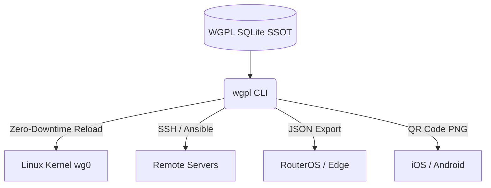

# WGPL (WireGuard Peer Lite) - Database-backed CLI for Zero-Downtime Peer Management & IPAM

[](https://github.com/aleaz/wgpl/actions/workflows/ci.yml)
[](LICENSE)
[](https://www.python.org/downloads/)


**WGPL (WireGuard Peer Lite)** is a lightweight, database-backed CLI for managing WireGuard peers across multiple servers.

**The Problem:** Managing WireGuard manually means editing text files (`wg0.conf`), guessing which IPs are free, and restarting interfaces (dropping all active connections) just to add one user. It also lacks a clear history of who was granted access.

**The Solution:** WGPL decouples peer management from your OS. It uses a local SQLite database to automatically handle IP allocation (IPAM), generates configurations natively, and applies changes to the Linux kernel with **zero downtime**. It features a robust, append-only audit trail built on SQLite triggers. When combined with proper OS-level access controls, it simplifies SOC2 and ISO27001 compliance by generating a centralized historical record of IP assignments and peer lifecycles, reducing overhead during access reviews.

## How it compares to wg-quick

| Feature | `wg-quick` (Manual) | `wgpl` |
| --- | --- | --- |
| **Peer Storage** | Text files (`.conf`) | Relational SQLite Database |
| **IP Allocation** | Manual (Risk of collisions) | Automatic CIDR IPAM |
| **Applying Changes** | Restarts interface (Drops connections) | Zero-downtime hot-reloads (`wg syncconf`) |
| **Audit & History** | None | Robust Append-Only Log |
| **Expiration** | Manual cleanup | Built-in TTL (`--expires 24h`) |

> **Note on Network Topology:** WGPL is explicitly designed for **Hub-and-Spoke** Remote Access VPNs. If you need a Server-to-Server Full-Mesh overlay, we recommend using Netmaker or Tailscale instead.

## 1-Minute Quick Start

### 1. Install

**Option A: Standalone Binary (Recommended for Linux Routers)**
No dependencies required.

```bash
curl -sL https://github.com/aleaz/wgpl/releases/latest/download/wgpl-linux-amd64 -o /usr/local/bin/wgpl
chmod +x /usr/local/bin/wgpl
```

> **Update Note:** The standalone binary must be updated manually by re-running this command when a new release is published.

**Option B: Python / uv (Recommended for Developers & Admins)**
Requires Python 3.12+. Using `uv` is convenient as it makes it trivial to get the latest updates (by simply running `uv tool upgrade wgpl`) or to install the bleeding-edge version directly from the repository.

```bash
uv tool install wgpl
```

### 2. Register an Interface & Add a Peer

WGPL doesn't create the interface; it manages who connects to it.

```bash
# Register an interface and define its IP pool
wgpl interface add wg0 vpn.example.com <WG0_PUBKEY> 10.0.0.0/24

# Add a user (WGPL automatically assigns the next free IP)
wgpl peer add wg0 "Alice_Laptop"
```

### 3. Apply and Export

```bash
# Sync changes to the Linux kernel without dropping connections (requires sudo to write to /etc/wireguard)
sudo wgpl apply wg0

# Get the QR code for Alice's phone
wgpl peer qr "Alice_Laptop"

# Or get the config file for her desktop
wgpl peer config "Alice_Laptop" > alice.conf
# Note: Ensure your umask is set securely or run `chmod 600 alice.conf` to protect private keys.
```

## Table of Contents

- [Decoupled Architectures (BYOI)](#decoupled-architectures-byoi)
- [Features](#features)
- [Client Provisioning (End-User Devices)](#client-provisioning-end-user-devices)
- [Enterprise Lifecycle & Audit (SRE)](#enterprise-lifecycle--audit-sre)
- [Advanced Integrations](#advanced-integrations)
- [Configuration](#configuration)
- [Upgrading](#upgrading)
- [Contributing](#contributing)

## Decoupled Architectures (BYOI)

WGPL follows a "Bring Your Own Interface" (BYOI) philosophy. **It is not a network daemon, it does not route traffic, and it does not create the initial `wg0` interface.** You provide the interface; WGPL manages the peers.

> **Why we don't manage your routing or `iptables`:** Tools that hijack system routing often break Docker, Kubernetes, or corporate firewalls. WGPL leaves you in full control of your infrastructure's network rules.



### 1. Native Linux Server (Zero-Downtime Systemd)

Run WGPL directly on the VPN Gateway (Debian/Ubuntu). You can automate garbage collection and peer synchronization using Systemd without ever bringing the interface down.

**Systemd Automation Example:**
Create a systemd service (`/etc/systemd/system/wgpl-sync.service`) to prune expired peers and hot-reload the kernel:

```ini
[Unit]
Description=WGPL Sync & Prune
After=wg-quick@wg0.service

[Service]
Type=oneshot
ExecStartPre=/usr/local/bin/wgpl peer prune wg0
ExecStart=/usr/bin/sudo /usr/local/bin/wgpl apply wg0
```

Trigger it with a `.timer` every 5 minutes to fully automate your VPN lifecycle.

### 2. Remote Linux Servers (CI/CD Pipeline)

Run WGPL in your GitHub Actions, GitLab CI, or an Ansible control node to provision multiple servers remotely via SSH.

```bash
# 1. Export the declarative configuration for Server A
wgpl interface export server-a-wg0 > server-a.conf

# 2. Pipe it securely over SSH to apply changes seamlessly
cat server-a.conf | ssh root@server-a "wg syncconf wg0 /dev/stdin"
```

### 3. MikroTik (RouterOS v7) Appliances

Bring modern IPAM, TTL, and Audit capabilities to hardware routers that lack these features natively.

```bash
# Extract configuration via JSON and generate an .rsc script (hub AllowedIPs / allowed-address)
wgpl --json peer list | jq -r '.[] | "/interface wireguard peers add interface=wg0 public-key=\"\(.public_key)\" allowed-address=\"\(.hub_allowed_ips | join(","))\""' > mikrotik_sync.rsc
```

Then import `mikrotik_sync.rsc` into your router.

### 4. Docker Containers (Ephemeral CI/CD)

WGPL is available as a lightweight Docker container. To persist your database, mount a local directory to `/data`.

```bash
alias wgpl='docker run --rm -it -v $(pwd)/wgpl-data:/data ghcr.io/aleaz/wgpl'

# Now you can use it exactly like the local CLI
wgpl interface list
```

**Note for applying changes:** If you want the container to apply changes to the host's Linux kernel (via `wg syncconf`), you must grant it network administration capabilities and run it in the host's network namespace:

```bash
docker run --rm -v $(pwd)/wgpl-data:/data \
  --cap-add NET_ADMIN --network host \
  ghcr.io/aleaz/wgpl apply wg0
```

## Features

### Multi-Server Ready

Manage an unlimited number of WireGuard servers from a single SQLite database.

- **Composite Identity:** Interface names (e.g. `wg0`) can be repeated across different servers. WGPL identifies tunnels by their composite key (`Name + Endpoint + Port`).
- **Global IPAM:** Automatic allocation of free IPv4 addresses within a CIDR block per server.
- **Idempotent by Design:** Running `wgpl apply` repeatedly is completely safe. It only syncs deltas to the kernel.

### Safe Concurrency

- **CI/CD Ready:** SQLite WAL mode and exclusive locks ensure multiple CI/CD pipelines won't corrupt the state when running concurrently.

### Advanced Networking

Bring enterprise networking features to your tunnels automatically:

- **Intent-based routing:** Declare `role`, `routed_networks`, and `allowed_ips_policy`; WGPL derives hub and client `AllowedIPs` at export time. Patterns: split/full tunnel, subnet routers, LAN↔LAN via hub. See [docs/ROUTING.md](docs/ROUTING.md) and the [hub relay runbook](docs/runbook.md#hub-routing-relay).
- **Per-Peer Granularity:** Customize `MTU`, `PersistentKeepalive`, and `DNS` at the interface level (default) or override them per peer.
- **FQDN & IP Support:** Endpoints are proactively validated via RFC 1123, ensuring your generated configs are always resolvable by WireGuard.

### Security & Cryptography

- **Native Generation:** Public/private key generation (X25519) in native RAM using Python's `cryptography` (no `wg genkey` subprocesses).
- **Hardened Validation:** 32-byte Base64 key validation prevents kernel panics during configuration synchronization.
- **Secure by Default:** Automatic strict permissions (`chmod 600`) on databases and exported QR codes.

### Automation and State

- **Strict JSON Output (`--json`)** for M2M integration (Ansible, Terraform, Bash).
- **Hot-Reloads:** Declarative synchronization with the Linux kernel using `wg syncconf` (without dropping TCP connections).

## Client Provisioning (End-User Devices)

Delivering the VPN to the end-user is as simple as running a command. WGPL provides formats ready for every platform.

### Mobile (iOS / Android)

Users running the official WireGuard App can scan a QR code.

```bash
# Show ASCII QR Code directly in the terminal
wgpl peer qr <PEER_ID>

# Or export it to send securely to remote users
wgpl peer qr <PEER_ID> -o ios_tunnel.png
```

### Desktop (Windows / macOS)

Export the standard `.conf` file to be imported into the official WireGuard desktop client.

```bash
wgpl peer config <PEER_ID> > my_laptop.conf
# Note: Ensure your umask is set securely or run `chmod 600 my_laptop.conf` to protect private keys.
```

### Linux Clients

For users on Linux, export the config directly to `/etc/wireguard/` and enable the service.

```bash
wgpl peer config <PEER_ID> | sudo tee /etc/wireguard/wg0.conf > /dev/null
sudo systemctl enable --now wg-quick@wg0
```

## Enterprise Lifecycle & Audit (SRE)

WGPL is built for operations teams that need traceability and access control.

### Temporary Access (TTL)

Create peers that automatically expire. Ideal for contractors or temporary access.

```bash
wgpl peer add wg0 "Contractor_Audit" --expires 48h
```

*(Expired peers are ignored by `wgpl apply` and `wgpl interface export`)*

### Garbage Collection & Deletion

WGPL uses **Soft Deletes** by default to maintain historical records while freeing up the IP address.

```bash
# Soft delete a peer (IP is freed, history remains)
wgpl peer remove wg0 <PEER_ID>

# Permanently purge expired or soft-deleted peers
wgpl peer prune wg0

# Hard delete (Physical DB wipe + Audit event)
wgpl peer remove wg0 <PEER_ID> --hard
```

### Audit Trail

WGPL uses SQLite Triggers to maintain a robust, append-only audit log.

```bash
# View the lifecycle history of an interface
wgpl interface history wg0

# Audit every IP change, DNS override, or Expiration of a specific peer
wgpl peer history wg0 <PEER_ID>
```

### Backups & disaster recovery

WGPL provides an atomic binary backup system that validates schema integrity before swapping the live database.

```bash
# Binary SQLite backup (contains peers, private keys, and full audit history)
wgpl db dump -o backup.db
chmod 600 backup.db

# Destructive restore (requires --yes)
wgpl db restore --yes backup.db
```

> **Multi-server note:** two interfaces may share the same name (e.g. `wg0`) if they differ by endpoint/port. Use the numeric **interface ID** from `wgpl interface list` when names are ambiguous.

### Audit retention

The `audit_events` table is **append-only** (SQLite triggers block UPDATE/DELETE). It grows with every peer and interface change.

| Goal | Tool |
|---|---|
| Archive history for compliance | `wgpl db dump -o archive-YYYY-MM.db` periodically; store off-host with `chmod 600` |
| Remove inactive peer rows (not audit) | `wgpl peer prune <interface>` |
| Query past events | `wgpl peer history` / `wgpl interface history` |

There is no `audit prune` command — audit rows are never deleted in-place by design.

## Advanced Integrations

WGPL is designed to integrate seamlessly into modern DevOps and Cloud-Native stacks. To keep this README clean, we have provided fully working examples in the `examples/` directory:

- **[Ansible Playbook](examples/ansible-deployment.yml):** Centralize multi-server zero-downtime updates from an Ansible control node.
- **[Terraform & Cloud Firewalls](examples/terraform-external-data.tf):** Dynamically whitelist WireGuard peer IPs in an AWS Security Group (or GCP/Azure) using Terraform's `external` data source.
- **[GitHub Actions (GitOps)](examples/github-actions-gitops.yml):** Deploy VPN configuration seamlessly via CI/CD from a declarative YAML state.
- **[FastAPI Self-Service Portal](examples/fastapi-self-service.py):** Embed WGPL inside a Python web API to generate and return QR codes to users automatically. Perfect for delegating VPN access to non-technical HR or IT Support staff without building a heavy UI.

## Upgrading

Recent releases enforce a **minimum MTU of 1280** on export, apply, and mutations
(was 576). Before upgrading, check for low MTU values and fix them:

```bash
wgpl validate
wgpl interface list --json | jq '.[] | select(.mtu != null and .mtu < 1280)'
wgpl peer list --json | jq '.[] | select(.mtu != null and .mtu < 1280)'
```

Update affected rows (`interface update --mtu 1280`, `peer update --mtu 1280`, or
`--clear-mtu`), then upgrade the tool. See [docs/runbook.md](docs/runbook.md#upgrading-wgpl)
for the full checklist.

## Configuration

WGPL requires zero configuration, but respects the following environment variables:

| Variable | Description | Default |
| --- | --- | --- |
| `WGPL_DB_PATH` | Path to the local SQLite database used to store cryptographic state. | `~/.wgpl.db` |
| `WGPL_WG_BIN` | Path to the `wg` binary used by `apply` and `syncconf`. (**Security:** Ignored when running as root to prevent Privilege Escalation; safely defaults to `/usr/bin/wg`) | `wg` (PATH) |

*Note: `wireguard-tools` (`wg`) is **only** necessary if you want to run `wgpl apply` on the same machine.*

WGPL features a self-documenting CLI. Run `wgpl --help` to explore commands, or check out the [Full CLI Reference](docs/cli.md) for details.

## Contributing

Contributions are always welcome. Getting started is easy:

```bash
git clone https://github.com/aleaz/wgpl.git
cd wgpl
uv sync
uv run pytest
```

Please read [CONTRIBUTING.md](CONTRIBUTING.md) to understand the architecture, version control strategy, and commit conventions.

## Author

- **Alejandro Azario** - [GitHub](https://github.com/aleaz)

## License

MIT
