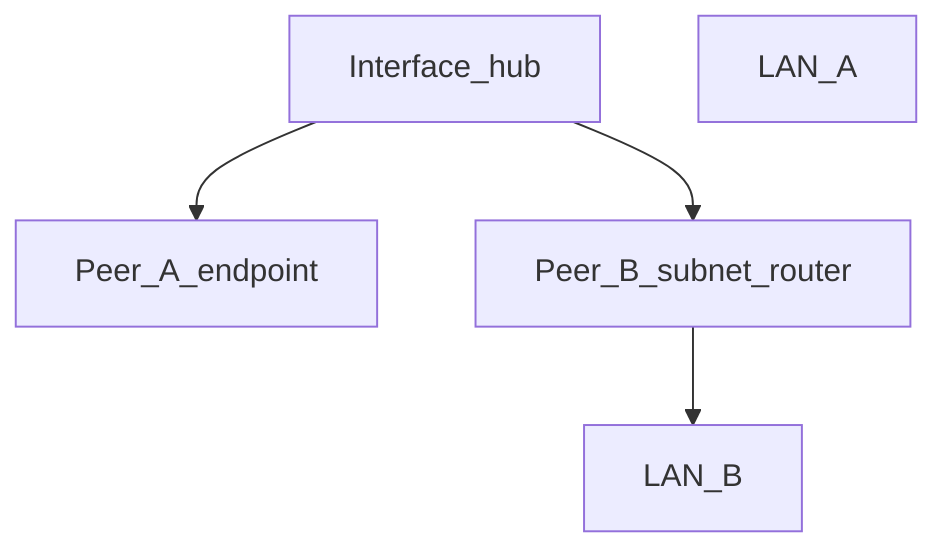

# WGPL Routing Model

WGPL is an **intent-based hub-and-spoke IPv4 routing generator**. You declare
what each peer and interface should reach; the tool **derives** WireGuard
`AllowedIPs` at export/apply time. Derived values are never stored in the database.

For entity definitions (VPN, Interface, Peer, Node, Route) and the domain vs
WireGuard boundary, see [DESIGN.md — Domain model](../DESIGN.md#domain-model).

## Glossary

| WGPL term | DB / CLI field | Industry equivalents | Meaning |
|-----------|----------------|----------------------|---------|
| VPN network | `interface.address_pool` | tailnet CIDR, Netmaker network | Tunnel address space for peers |
| Endpoint | `peer.role = endpoint` | remote client, remote access device | End device (laptop, phone, PC) |
| Subnet router | `peer.role = subnet_router` | Tailscale subnet router, Netmaker egress gateway | Node announcing LANs behind the tunnel |
| Routed networks | `peer.routed_networks` / `interface.routed_networks` | advertised routes, allowed-address (LAN part) | Comma-separated CIDRs **behind** a router or the hub |
| Allowed IPs policy | `peer.allowed_ips_policy` | split vs full tunnel scope | What to include in **client** `[Peer] AllowedIPs` |
| Hub AllowedIPs | derived | server `[Peer] AllowedIPs`, MikroTik `allowed-address` | What `apply` / `interface export` writes on the concentrator |
| Client AllowedIPs | derived | client `[Peer] AllowedIPs` | What `peer config` / `peer qr` emit (override with `--allowed-ips`) |

WireGuard-native names are **not renamed**: `AllowedIPs`, `Address`, `Endpoint`,
`PersistentKeepalive`, `PublicKey`, `PresharedKey`.

### `allowed_ips_policy` values

| Value | Client AllowedIPs |
|-------|-------------------|
| `vpn_only` (default) | VPN address pool only |
| `split_tunnel` | Pool + `interface.routed_networks` |
| `all_remote_networks` | Split-tunnel set + all other active subnet routers' `routed_networks` (excluding own LANs) |
| `full_tunnel` | `0.0.0.0/0` |
| `custom` | `peer.custom_allowed_ips` |

## Architecture

```
Intent (DB)  →  routing.py (derive)  →  integrity (validate)  →  wireformat (format)
```

- **`routing.py`** is the single source of derived AllowedIPs.
- **`wireformat.py`** formats only; it never computes routing.
- **`core.py`** emit gates call `routing` then `integrity` then `wireformat`.

Full specification matrix (topology → expected AllowedIPs): [routing_matrix.md](routing_matrix.md).

### Hub derivation

For every active peer on the hub:

```
Hub AllowedIPs = {tunnel_ip}/32 [, routed_networks… if subnet_router]
```

### Client derivation

Depends on `allowed_ips_policy` (see table above). For `all_remote_networks` on a
subnet router, **own** `routed_networks` are excluded so the site does not route
its LAN back into the tunnel.

## Operational patterns

| # | Pattern | role | allowed_ips_policy | Hub AllowedIPs | Client AllowedIPs |
|---|---------|------|--------------------|----------------|-------------------|
| 1 | Remote access full tunnel | endpoint | full_tunnel | /32 | 0.0.0.0/0 |
| 2 | Remote access split tunnel | endpoint | split_tunnel | /32 | pool + interface.routed_networks |
| 3 | VPN peers only | endpoint | vpn_only | /32 | pool |
| 4 | VPN + all remote LANs | endpoint | all_remote_networks | /32 | pool + interface routes + remote LANs |
| 5 | Site subnet router | subnet_router | all_remote_networks | /32 + LAN | pool + remote LANs (not own) |
| 6 | Site-to-site via hub | 2× subnet_router | all_remote_networks | each /32 + LAN | symmetric via motor |
| 7 | Endpoint ↔ endpoint via hub | endpoint | vpn_only | /32 each | pool |
| 8 | Manual exception | any | custom | derived | custom_allowed_ips |

### LAN↔LAN bidirectional via hub (four legs)

1. Hub peer A: AllowedIPs = `{tunnel}/32`, `{LAN A}`
2. Hub peer B: AllowedIPs = `{tunnel}/32`, `{LAN B}`
3. Router A client config includes LAN B
4. Router B client config includes LAN A

With `allowed_ips_policy=all_remote_networks` on subnet routers, legs 3–4 are
derived automatically when sites are added.

**Operator responsibility:** WGPL does not enable kernel forwarding or firewall
rules. On the hub, enable `net.ipv4.ip_forward=1` and allow `FORWARD` on the
WireGuard interface (and MASQUERADE if needed). See
[runbook — Hub routing relay](runbook.md#hub-routing-relay).

## Routing invariants

Formal rules enforced by `integrity.py` (mutation / export) and
`consistency.py` (`wgpl validate`). The routing **algorithm** lives in
`routing.py`; these are the **constraints** it assumes.

| Invariant | Rule | Enforced at |
|-----------|------|-------------|
| Unique prefix ownership | No two active subnet routers may advertise overlapping `routed_networks` on the same interface | `assert_peer_activation` (mutation); `validate` (`overlapping_routed_networks`) |
| Pool disjunction | No `routed_networks` prefix may overlap `address_pool` | `validate_routed_networks_list` |
| Tunnel identity | Peer tunnel IP must not fall inside its own `routed_networks` | `validate_routed_networks_list(tunnel_ip=…)` |
| No egress in LAN fields | `0.0.0.0/0` forbidden in `routed_networks` (use `full_tunnel` on clients) | `validate_routed_networks_list` |
| Role coherence | `endpoint` ⇒ `routed_networks IS NULL`; `subnet_router` ⇒ non-empty LANs | CHECK + `_validate_peer_routing_fields` |
| Custom coherence | `allowed_ips_policy=custom` ⇒ `custom_allowed_ips NOT NULL` | CHECK + integrity |
| Own-LAN exclusion | `all_remote_networks` never includes the peer's own `routed_networks` in client export | `routing.resolve_client_allowed_ips` |
| Active-only derivation | Expired / soft-deleted peers excluded from hub export and remote LAN union | `integrity.is_peer_active` in emit gates |
| Single derivator | Only `routing.py` computes AllowedIPs prefix lists | code audit — see [DESIGN.md](../DESIGN.md#architecture-verification) |

**Known gap:** overlap between `interface.routed_networks` and a peer's
`routed_networks` is not rejected automatically. Avoid duplicating the same CIDR
on hub and site; a future validate warning may be added.

**Routing loops:** The hub-and-spoke model plus own-LAN exclusion prevents a
subnet router from installing a client route to its own LAN via the tunnel.
There is no multi-hop peer chain in scope — all traffic relay goes through the hub
operator's kernel forwarding, not recursive WireGuard `[Peer]` blocks.

## Reachability model (conceptual graph)

Lists in docs and CLI output are a flattened view of a **reachability graph**:



- **Hub → peer:** always `{tunnel}/32`; subnet routers add LAN edges.
- **Client export:** policy selects which nodes/prefixes the peer may reach
  (pool, hub LANs, remote LANs, full Internet, or custom).
- Implementation uses prefix lists, not an explicit graph object — sufficient
  for hub-and-spoke; a graph structure would only help if multi-hop or policy
  routing is added later.

## Invalid topologies

See [routing_matrix.md — Invalid topologies](routing_matrix.md#invalid-topologies)
for the full table with enforcement points and tests.

Summary of what **must not** exist in a healthy database:

- Overlapping or duplicate `routed_networks` between active subnet routers
- LAN prefixes that overlap the VPN pool or contain a peer's tunnel IP
- `0.0.0.0/0` in `routed_networks` fields
- Subnet routers without LANs, or endpoints with LAN fields
- Wire-unsafe or unparseable CIDR text (restore / export fail-closed)

Warnings (validate exits 0): missing keepalive on NAT subnet routers, asymmetric
`all_remote_networks`, incomplete LAN↔LAN derivation, expired subnet routers
still in DB.

## Module responsibilities (routing)

| Module | Responsibility | Must not |
|--------|----------------|----------|
| `routing.py` | Derive hub/client AllowedIPs from intent | I/O, Typer, DB, wire-format output |
| `integrity.py` | Validate invariants, export safety, activation gates | Derive AllowedIPs |
| `wireformat.py` | Serialize precomputed AllowedIPs to `.conf` text | Compute routing |
| `core.py` | Orchestrate emit gates, CRUD, call `routing` then `integrity` | Duplicate routing logic |
| `consistency.py` | Topology checks for `validate` | Mutate state |
| `cli.py` | Presentation, `--json`, Typer | Import `db`; compute routes |

## WireGuard coverage boundary

WGPL = **complete hub-and-spoke IPv4 routing intent**, not a full
`wg-quick.conf` emulator.

### In scope

- Remote access (split and full tunnel)
- Subnet routers announcing LAN prefixes
- LAN↔LAN relay through a central hub
- NAT traversal via `PersistentKeepalive` (already in WGPL)
- PSK, DNS, MTU, keepalive on export

### Partially in scope (operator or future work)

- **Hub relay forwarding** — config yes; `ip_forward` / iptables manual ([runbook](runbook.md#hub-routing-relay))
- **Egress / exit node** — not supported in `routed_networks` (`0.0.0.0/0` rejected; use `full_tunnel` on clients)
- **CLI `--allowed-ips` override** — ad-hoc export only (default is derived from policy)

### Out of scope (by design)

- Full mesh P2P, direct site-to-site (no hub), point-to-point two-node VPN
- IPv6, `PostUp`/`PostDown`, `Table`, `FwMark`
- Multiple client `[Peer]` blocks toward different hubs
- Kernel routing management, dynamic route daemons

## Database schema (routing columns)

New columns (see `db.init_db()`):

- `interfaces.routed_networks` — CIDRs behind the hub (split tunnel)
- `peers.role` — `endpoint` | `subnet_router`
- `peers.routed_networks` — CIDRs behind a subnet router
- `peers.allowed_ips_policy` — see table above
- `peers.custom_allowed_ips` — required when policy is `custom`

`PRAGMA user_version = 2`. Backups with `user_version = 1` are **not migratable**; restore rejects them.

## Industry mapping

| WGPL | Tailscale | Netmaker | WireGuard docs |
|------|-----------|----------|----------------|
| subnet_router | subnet router | egress gateway (LAN) | `[Peer] AllowedIPs` with /24 |
| routed_networks | advertised routes | egress ranges | site-to-site AllowedIPs |
| interface.routed_networks | — | additional addresses | split internal routes |
| full_tunnel | exit node (client) | internet gateway (client) | `0.0.0.0/0` |
| Hub AllowedIPs | — | server peer config | server `[Peer]` block |
