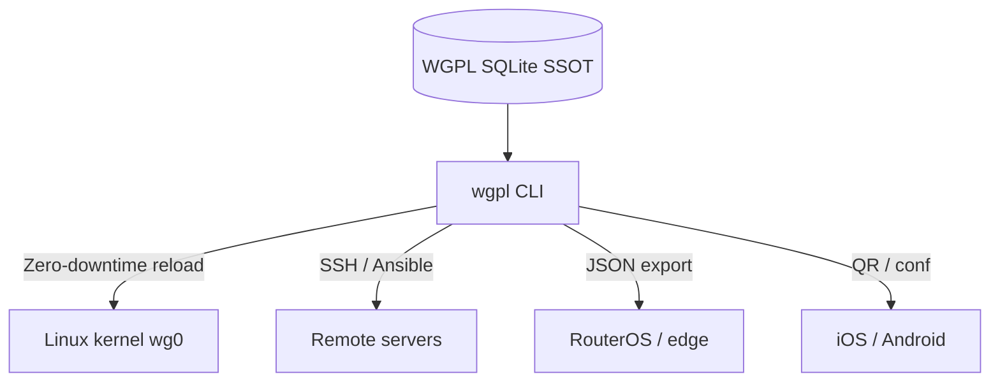

# WGPL Operations Runbook

Operational procedures for running WGPL in production. Complements
[SECURITY.md](../SECURITY.md) and the [CLI reference](cli.md).

## Wire-safe MTU

WGPL enforces a wire-safe MTU (minimum **1280**) on mutations, export, and apply.
MTU values must be ≥ 1280 or unset (null); explicit low values block `validate`,
`apply`, `interface export`, and client config export.

1. List MTU values on live data:

   ```bash
   wgpl interface list --json | jq '.data[] | {name, mtu}'
   wgpl peer list --json | jq '.data[] | {name, mtu}'
   ```

2. Fix any interface or peer with MTU below 1280:

   ```bash
   wgpl interface update wg0 --mtu 1280
   wgpl peer update <PEER_ID> -i wg0 --mtu 1280
   # or remove the override:
   wgpl peer update <PEER_ID> -i wg0 --clear-mtu
   ```

3. Run `wgpl validate` — it must pass before you rely on `apply` or client export.

## Post-mutation checklist

Every change that should reach WireGuard requires two steps after the mutation:

1. **Validate** (recommended after bulk changes or restore):

   ```bash
   wgpl validate [INTERFACE]
   ```

2. **Apply** (push active peers to the kernel):

   ```bash
   sudo wgpl apply INTERFACE
   ```

   Remote servers:

   ```bash
   wgpl interface export INTERFACE | ssh root@HOST wg syncconf INTERFACE /dev/stdin
   ```

Mutations (`peer add`, `peer remove`, `peer update`, `peer prune`, `interface update`)
update the SQLite database only. The kernel stays stale until `apply` or remote
`syncconf` runs. This is by design.

### Temporary access (TTL)

```bash
wgpl peer add "Contractor_Audit" -i wg0 --expires 48h
```

Expired peers are ignored by `apply` and `interface export` until pruned.

### Deletion and garbage collection

```bash
wgpl peer remove <PEER_ID> -i wg0          # soft delete — IP freed, audit retained
wgpl peer prune -i wg0                      # hard-delete inactive peer rows
wgpl peer remove <PEER_ID> -i wg0 --hard   # immediate physical delete + audit event
wgpl node prune                          # remove orphan device identities
```

### Audit trail

```bash
wgpl interface history wg0
wgpl peer history <PEER_ID> -i wg0
wgpl node history <NODE_REF>
```

The `audit_events` table is append-only (SQLite triggers block UPDATE/DELETE).
There is no `audit prune` — audit rows are never deleted in-place by design.
Retention and compliance archiving: [Audit log growth](#audit-log-growth).

## Hub routing relay

WGPL derives WireGuard `AllowedIPs` for hub-and-spoke topologies (remote access,
subnet routers, LAN↔LAN via hub). See [routing.md](routing.md) for the routing
model and pattern matrix.

**WGPL does not configure the Linux kernel routing table, `ip_forward`, or
firewall rules.** WireGuard cryptokey routing only decides which packets enter
the tunnel. The hub (and each site gateway) must forward packets between
interfaces when traffic should relay — for example LAN A → hub → LAN B.

### When you need hub forwarding

| Goal | WGPL handles | Operator handles on hub |
|------|--------------|-------------------------|
| Remote client → VPN peers only | Client + hub AllowedIPs | Usually nothing beyond `apply` |
| Remote client → hub LAN / internal nets | `interface.routed_networks`, split tunnel | `ip_forward` + FORWARD if hub LAN is a physical interface |
| Site LAN ↔ site LAN via hub | Subnet routers + `all_remote_networks` | `ip_forward` + FORWARD on `wg0` (and often MASQUERADE off the uplink) |
| Full tunnel (all traffic via hub) | `allowed_ips_policy=full_tunnel` | FORWARD + MASQUERADE on hub uplink if clients need Internet |
| Bridge traffic between two VPN domains | Peer model only — see [routing — Bridging two hubs](routing.md#advanced-bridging-two-hubs-hub-as-subnet_router) | `ip_forward` + FORWARD between the **local hub** iface and the **bridge** iface on the host that terminates the bridge |

### Bridging two hubs (operator pattern)

When two hubs must exchange site LANs, treat the remote hub host as a
`subnet_router` spoke (not a product “federation” feature). Full checklist and
limits: [routing.md — Advanced: bridging two hubs](routing.md#advanced-bridging-two-hubs-hub-as-subnet_router).
On the bridge host, forward between the domain’s hub WireGuard interface and the
separate bridge interface that runs the peer config from the other hub.

### End-to-end workflow

1. **Declare intent** in WGPL (interface pool, optional `interface.routed-networks`,
   peers with `--role`, `--routed-networks`, `--allowed-ips-policy` as needed).
2. **Validate** routing topology:

   ```bash
   wgpl validate wg0
   wgpl --json validate wg0 | jq '.issues'
   ```

   Errors block `apply`; warnings (e.g. missing keepalive on a subnet router
   behind NAT) exit 0 but should be reviewed.
3. **Inspect derived AllowedIPs** before distributing configs:

   ```bash
   wgpl peer list                 # note the peer ID / hex prefix for Site_A_GW
   wgpl peer explain <PEER_ID>
   wgpl --json peer list | jq '.data[] | {name, hub_allowed_ips, client_allowed_ips}'
   ```

   For LAN↔LAN, confirm the four-leg checklist in `peer explain` shows
   `complete: yes` for each remote site pair.
4. **Apply hub config**:

   ```bash
   sudo wgpl apply wg0
   # remote hub:
   wgpl interface export wg0 | ssh root@HUB wg syncconf wg0 /dev/stdin
   ```
5. **Enable forwarding and firewall on the hub** (see checklist below).
6. **Deploy client configs** at each site (`peer config` / `peer qr`) and run
   `wg-quick up` or your RouterOS import. Site gateways also need `ip_forward`
   and LAN routing for their advertised `routed_networks`.

### Hub relay checklist (Linux)

Replace `wg0` and `eth0` with your WireGuard interface and uplink/LAN interface.

**1. IPv4 forwarding (required for any relay)**

```bash
# Immediate
sudo sysctl -w net.ipv4.ip_forward=1

# Persistent (Debian/Ubuntu)
echo 'net.ipv4.ip_forward=1' | sudo tee /etc/sysctl.d/99-wgpl-forward.conf
sudo sysctl --system
```

**2. Allow forwarded traffic on WireGuard (LAN↔LAN and spoke-to-spoke via hub)**

```bash
# Traffic between peers on the same wg interface
sudo iptables -A FORWARD -i wg0 -o wg0 -j ACCEPT
```

**3. Hub LAN access (split tunnel to networks behind the hub)**

If `interface.routed-networks` includes prefixes reachable via `eth0` (or
another NIC):

```bash
sudo iptables -A FORWARD -i wg0 -o eth0 -j ACCEPT
sudo iptables -A FORWARD -i eth0 -o wg0 -m state --state RELATED,ESTABLISHED -j ACCEPT
```

**4. NAT / masquerade (optional — Internet egress through hub)**

Only when remote clients or site LANs should use the hub's public IP for
non-VPN destinations (full tunnel or egress via hub):

```bash
sudo iptables -t nat -A POSTROUTING -o eth0 -j MASQUERADE
```

Use `nftables` equivalents if your distro defaults to nft. Persist rules with
your platform's firewall manager (`iptables-persistent`, `firewalld`, etc.) —
WGPL does not install or manage these rules.

**5. Verify**

```bash
sysctl net.ipv4.ip_forward
sudo iptables -L FORWARD -v -n
sudo iptables -t nat -L POSTROUTING -v -n   # if using MASQUERADE
wg show wg0
```

From a remote client or site LAN, ping a tunnel IP and a remote LAN gateway.
Use `tcpdump -i wg0` on the hub if packets arrive but do not leave toward the
target LAN.

### Operational patterns (quick reference)

See [routing.md — Operational patterns](routing.md#operational-patterns) for
the full matrix. Typical WGPL commands:

**Remote access — full tunnel**

```bash
wgpl peer add "Road_Warrior" -i wg0 --allowed-ips-policy full_tunnel
sudo wgpl apply wg0
# Hub: FORWARD + MASQUERADE on uplink if clients need Internet
```

**Remote access — split tunnel (VPN + hub internal nets)**

```bash
wgpl interface update wg0 --routed-networks "10.50.0.0/16,192.168.100.0/24"
wgpl peer add "Road_Warrior" -i wg0 --allowed-ips-policy split_tunnel
sudo wgpl apply wg0
# Hub: ip_forward + FORWARD wg0 ↔ interface carrying those prefixes
```

**Site subnet router (LAN behind a gateway)**

```bash
wgpl peer add "Site_A_GW" -i wg0 \
  --role subnet_router \
  --routed-networks "192.168.10.0/24" \
  --allowed-ips-policy all_remote_networks \
  --keepalive 25
sudo wgpl apply wg0
wgpl peer list                  # copy Site_A_GW's peer ID (or unique hex prefix)
wgpl peer config <PEER_ID> > site-a-wg0.conf
# Site gateway: enable ip_forward; wg-quick up; ensure LAN hosts use the GW
```

**LAN↔LAN via hub (two sites)**

```bash
# Site A and Site B: both subnet_router + all_remote_networks + keepalive
wgpl validate wg0
wgpl peer list
wgpl peer explain <PEER_ID_SITE_A>
wgpl peer explain <PEER_ID_SITE_B>
sudo wgpl apply wg0
# Hub: ip_forward + FORWARD -i wg0 -o wg0 (minimum)
```

Subnet routers behind NAT **must** have effective `PersistentKeepalive` (peer
override or interface default). Otherwise the hub cannot maintain return paths
and LAN↔LAN becomes intermittent. `validate` emits
`subnet_router_missing_keepalive` as a warning.

### Routing validation issues

| Code | Severity | Meaning | Action |
|------|----------|---------|--------|
| `overlapping_routed_networks` | error | Two active subnet routers advertise overlapping CIDRs | Fix `routed_networks` on one peer; overlaps make hub routing non-deterministic |
| `routed_networks_overlaps_pool` | error | A routed prefix overlaps the VPN pool | Choose disjoint CIDRs |
| `subnet_router_missing_routed_networks` | error | `role=subnet_router` without LAN CIDRs | Set `--routed-networks` or change role to `endpoint` |
| `subnet_router_missing_keepalive` | warning | Subnet router with no effective keepalive | Set `--keepalive 25` (or interface default) for NAT traversal |
| `expired_subnet_router_routes_dropped` | warning | Expired subnet router no longer advertises LANs | Expected; run `peer prune` to reclaim rows |
| `asymmetric_remote_access` | warning | Subnet router not using `all_remote_networks` while others advertise LANs | Use `all_remote_networks` for bidirectional LAN↔LAN |
| `lan_to_lan_incomplete` | warning | Derived client AllowedIPs missing a remote LAN | Fix policy or topology; confirm with `peer explain` |

### MikroTik / RouterOS hub

Map WGPL **hub AllowedIPs** to WireGuard `allowed-address` on RouterOS v7.
Full import workflow: [Deployment patterns — MikroTik](#mikrotik-routeros-v7).

## Deployment patterns (BYOI)

Run WGPL against hubs you already operate. WGPL does not manage `iptables` or
system routing — tools that hijack those layers often break Docker, Kubernetes,
or corporate firewalls.



### Native Linux server (systemd)

<a id="automated-lifecycle-systemd"></a>

Automate prune and hot-reload on the VPN gateway. Pin the same DB path the
operator uses (example assumes `/var/lib/wgpl/wgpl.db`):

```ini
# /etc/systemd/system/wgpl-sync.service
[Unit]
Description=WGPL Sync and Prune
After=wg-quick@wg0.service

[Service]
Type=oneshot
Environment=WGPL_DB_PATH=/var/lib/wgpl/wgpl.db
ExecStartPre=/usr/local/bin/wgpl peer prune -i wg0
ExecStart=/usr/bin/sudo --preserve-env=WGPL_DB_PATH /usr/local/bin/wgpl apply wg0
```

```ini
# /etc/systemd/system/wgpl-sync.timer
[Unit]
Description=Run WGPL sync every 5 minutes

[Timer]
OnBootSec=2min
OnUnitActiveSec=5min

[Install]
WantedBy=timers.target
```

Enable: `systemctl enable --now wgpl-sync.timer`

### Remote Linux servers (CI/CD)

```bash
wgpl validate wg0
wgpl interface export wg0 > hub-peers.conf
cat hub-peers.conf | ssh root@hub-host "wg syncconf wg0 /dev/stdin"
```

One-liner form (same effect):

```bash
wgpl interface export wg0 | ssh root@hub-host "wg syncconf wg0 /dev/stdin"
```

### MikroTik (RouterOS v7)

```bash
wgpl --json peer list -i wg0 | jq -r '.data[] | "/interface wireguard peers add interface=wg0 public-key=\"\(.public_key)\" allowed-address=\"\(.hub_allowed_ips | join(","))\""' > mikrotik_sync.rsc
```

Import `mikrotik_sync.rsc` on the router. Subnet-router peers need `/32` plus
their LAN prefix in `allowed-address`; endpoints need only `/32`. WGPL JSON
includes the derived list so you do not hard-code `/32` only.

<a id="deployment-patterns-docker"></a>

### Docker

```bash
alias wgpl='docker run --rm -it -v $(pwd)/wgpl-data:/data ghcr.io/aleaz/wgpl'
wgpl interface list
```

To apply on the **host** kernel:

```bash
docker run --rm -v $(pwd)/wgpl-data:/data \
  --cap-add NET_ADMIN --network host \
  ghcr.io/aleaz/wgpl apply wg0
```

## Client provisioning

Export on the **management host**, then install on the end-user device. For
non-trivial routing, run `wgpl peer explain` before distributing configs.

### Mobile (iOS / Android)

```bash
wgpl peer qr <PEER_ID>
wgpl peer qr <PEER_ID> -o alice-phone.png
```

`<PEER_ID>` is the peer UUID or unique hex prefix from `peer list` (not the node name).

### Desktop (Windows / macOS)

```bash
wgpl peer config <PEER_ID> > alice.conf
chmod 600 alice.conf
```

Import `alice.conf` into the official WireGuard desktop app.

### Linux (end-user machine)

On the **client laptop or workstation** (not the VPN hub), install the exported
config. The interface name is a local choice (`wg-wgpl`, `wg0`, etc.):

```bash
# Run on the end-user machine after copying alice.conf
sudo cp alice.conf /etc/wireguard/wg-wgpl.conf
sudo chmod 600 /etc/wireguard/wg-wgpl.conf
sudo systemctl enable --now wg-quick@wg-wgpl
```

## Backup and disaster recovery

### Backup

```bash
wgpl db dump -o /secure/path/wgpl-$(date +%Y%m%d).db
chmod 600 /secure/path/wgpl-*.db
```

- Store backups off-host with the same filesystem permissions as the live DB.
- Never commit `*.db` files to version control.

### Restore

```bash
wgpl db restore --yes /secure/path/wgpl-20250706.db
wgpl validate
sudo wgpl apply wg0
```

Restore is destructive and replaces the live database after validation. WGPL
rejects backups with invalid schema, malformed wire-format fields, or weakened
audit triggers. The swap uses `os.replace` after a final re-validation pass.

### Database doctor

Every CLI command validates the live schema on open. If the database fails
schema contract (extra tables, weakened audit triggers, etc.), commands fail
closed until the issue is resolved:

```bash
wgpl db doctor              # list schema and consistency issues
wgpl db doctor --repair     # reinstall audit triggers; normalize deleted_at=''
```

Use `doctor --repair` only after reviewing the reported issues. For unauthorized
schema objects, restore from a known-good backup instead of ad-hoc SQL edits.

### Export vs apply equivalence

`interface export`, `peer config`, and `apply` all pass through the same emit
gate: `validate` preflight plus `assert_exportable_*` on every field that
reaches WireGuard text output. A tampered row that blocks `apply` also blocks
export — there is no weaker export path.

## Key rotation and exposure

WGPL does not rotate keys via `peer update`. If a private key or PSK may have
been exposed:

1. `wgpl peer remove PEER_ID -i INTERFACE`
2. `sudo wgpl apply INTERFACE`
3. `wgpl peer add "New_Device_Name" -i INTERFACE`
4. Distribute the new client config or QR to the user.

Revoke the old config on the client device.

## Audit log archival

`audit_events` is append-only and grows without in-place deletion. Archive
periodically:

```bash
wgpl db dump -o archive-$(date +%Y%m).db
chmod 600 archive-$(date +%Y%m).db
```

Use `peer history` and `interface history` for access reviews. Audit rows store
public keys only; private keys and PSKs are never logged.

## Access review (compliance)

For periodic access reviews:

```bash
wgpl peer list -i wg0 --json
wgpl peer history <PEER_ID> -i wg0 --limit 100
```

Cross-check active peers against your identity source. Remove stale access with
`peer remove` followed by `apply`.

## Incident response

| Scenario | Action |
|----------|--------|
| Suspected DB compromise | Rotate all peers (remove + re-add), restrict filesystem access, restore from last known-good backup if tampering is confirmed |
| Leaked client config / QR | Remove peer, apply, issue new peer |
| Kernel out of sync | `wgpl validate` then `wgpl apply` |
| Corrupt database | Restore from backup; if none, re-init and re-provision peers |

## Environment and permissions

| Variable | Purpose |
|----------|---------|
| `WGPL_DB_PATH` | Database location (default `~/.wgpl.db`) |
| `WGPL_EXEC_CMD` | Optional audit metadata (sanitized, bounded) |

Ensure the database path is a regular file with mode `600`, owned by the operator.
Symlinks at `WGPL_DB_PATH` are rejected. Prefer a dedicated directory with mode
`700` for the DB: SQLite may create `-wal` / `-shm` sidecars that can contain
secrets; keep the parent directory private.

### Audit log growth

`audit_events` is append-only (no in-place delete). Archive periodically:

```bash
wgpl db dump -o archive-$(date +%Y%m).db
chmod 600 archive-$(date +%Y%m).db
```

After a large archive, operators may `VACUUM` an offline copy for size; do not
expect WGPL to prune audit history in 1.0.x.

For integrity monitoring, checksum a `wgpl db dump -o …` artifact (or an offline
copy). Do not rely on a raw hash of the live `.db` file alone: SQLite may rewrite
file bytes on open without changing logical table content.

### Compliance and access reviews

With proper OS-level access controls, centralized lifecycle and audit records can
simplify SOC2 and ISO27001 access reviews.

| Goal | Tool |
| --- | --- |
| Archive history for compliance | `wgpl db dump -o archive-YYYY-MM.db`; store off-host with `chmod 600` |
| Remove inactive peer rows (not audit) | `wgpl peer prune -i <interface>` |
| Query past events | `peer history` / `interface history` / `node history` |

## Troubleshooting

Common operator traps (also summarized in [cli.md — Operational notes](cli.md#operational-notes)):

### Changes in the database but not on the hub

Mutations (`peer add`, `peer update`, `peer remove`, …) write SQLite only.
WireGuard does not change until you push:

```bash
wgpl validate wg0
sudo --preserve-env=WGPL_DB_PATH wgpl apply wg0
# or: sudo wgpl --db "$HOME/.wgpl.db" apply wg0
# remote hub:
wgpl interface export wg0 | ssh hub 'wg syncconf wg0 /dev/stdin'
```

### `apply` fails because the OS interface does not exist

WGPL is BYOI: `wgpl apply` calls `wg syncconf` on an **existing** kernel
interface. Create and bring up the netdev first (for example `wg-quick@wg0`),
then register the same name in WGPL with the hub public key from
`wg show <ifname> public-key`. See the README Quick Start BYOI section.

### `peer config` / `peer qr` asks for `-i`

When the database has **more than one interface**, secret export and
`--show-secrets` require an explicit interface so the peer cannot be resolved
across tunnels by accident:

```bash
wgpl peer config PEER_ID -i wg0
wgpl peer qr PEER_ID -i wg0
wgpl peer show PEER_ID --show-secrets -i wg0
```

### Permission denied on the database

The default path is `~/.wgpl.db` (mode `600`). If the file is owned by another
user (for example after a bare `sudo wgpl apply` without a shared `--db`),
open fails. `--help` / `--version` do **not** open the database. Fix ownership
or pin a path you own:

```bash
export WGPL_DB_PATH=/path/you/own/wgpl.db
wgpl --db /path/you/own/wgpl.db peer list
```

### Mutations require `-i`

`peer add`, `peer update`, `peer remove`, `peer prune`, and `peer history`
always take **`-i` / `--interface`**. Peer refs come first (same as `show` /
`config`); the interface is never a positional argument:

```bash
# correct
wgpl peer add "Alice" -i wg0
wgpl peer update PEER_ID -i wg0 --desc "laptop"
wgpl peer remove PEER_ID -i wg0
wgpl peer prune -i wg0
wgpl peer history PEER_ID -i wg0

# wrong — interface is not positional
# wgpl peer add wg0 "Alice"
# wgpl peer update wg0 PEER_ID --desc "laptop"
```

Rename a device with `wgpl node update REF --name NEW` — `peer update` has no
`--name`.

### Routing fields cleared on role / policy change

Setting `--role endpoint` clears `routed_networks` (subnet-router LANs are
invalid for endpoints). Setting `--allowed-ips-policy` to anything other than
`custom` clears `custom_allowed_ips`. Re-set those fields explicitly if you
still need them.
